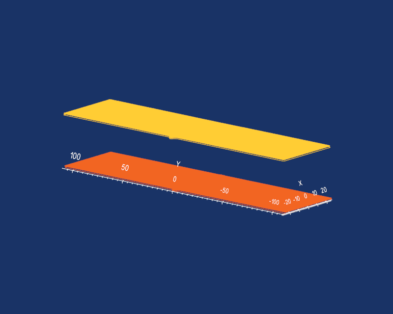
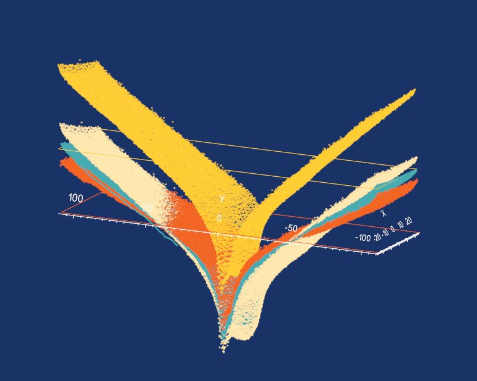

# align_average

## Background
Performing a contour method generates two surfaces where one needs to be mirrored and then subsequently aligned and then averaged to eliminate/minimize cutting artefacts.

This module allows for viewing the two surfaces, with one being a reference and the other the surface to be aligned and averaged (floating). The floating surface can be then mirrored, and aligned with the reference surface. Upon alignment, then the two surfaces are averaged along a common grid dictated by the extents of the reference surface outline.

## Initializing

The function is called from a Python script or in interactive mode, starting by importing align_average module from the pyCM package and then calling the `launch` method for example: 
~~~
>>> from pyCM import align_average as aa
>>> aa.launch()
~~~

Then, upon launching, the pyCM data file can be loaded via a GUI by pressing the `l` key if launched independently, or by specifying the file directly i.e. `aa.launch('full_path_to_file.pyCM')`. If using the pyCM [main](mainREADME.md) function, `Shift+l` will load any data from the active file. This results in a populated widget as shown in [Fig. 1](#fig1).

  
* Figure 1: Alignment and averaging widget showing a loaded pyCM file containing data from the registration step.*

This pyCM file must contain the following input:

Input | Description
---  |---
Output file	| A *.pyCM file which at minimum, contains two data structures needed for subsequent processing, *ref* and *float*, having optional attributes relating to cutting orientation, and the following groups on a per-entry basis:<ul><li>points: Nx3 array of the coordinate values.</li><li>active: An integer array of points indexing which points are actively being considered.</li><li>outline: Nx3 matrix of the points that comprise the outline</li></ul>
## Display
The display panel provides the ability to scale the z-aspect, similar to that in [registration](registrationREADME.md). A further option applicable to multi-entry datasets is to caption each entry within reference and floating point data, which appear in orange and yellow, respectively.

Opacity for the reference, floating and averaged (if intiated) can be scaled using the sliders which appear in this panel. Cutting orientations (if included from registration) can also be toggled via `Show cut`.

## Mirroring
Using the push buttons under the `Mirroring` pane will provide the ability to mirror the floating surface prior to alignment and averaging. These buttons will modify a transformation matrix (as do the `Alignment` controls). The `Reset` button in this panel will undo **all** transformations (both mirroing and alignment).

## Alignment
The `Alignment` panel provides multiple options for aligning the floating point dataset to the reference. Both the floating and reference data can be moved to their respective geometric centroids by selecting the appropriate radio button and pressing the smaller `Apply` button. Manual movement of the floating dataset can be acheived directly below this by making changes to either `Translate x`, `Translate y` and `Rotate about z` and pressing the larger `Apply` button. If in doubt between them, hovering over any of these buttons will provide a tool-tip.

Three algorithms have been implemented for auto-alignment:
* K-neighbour Iterative Closest Point (ICP) operates on the outlines of both reference and floating point data to provide a two dimensional transformation (translation in x and y and rotation about z) whereby the distance/error between outline points is minimized (`K-neighbour ICP`).
* A Singular Value Decomposition (SVD) algorithm which operates on 'corners' (points on the outlines which are closest to the corners of a bounding box) to produce a two dimensional transformation (`Corner SVD`).
* Another iterative closest point (ICP) technique, a [pre-existing VTK filter](https://www.vtk.org/doc/nightly/html/classvtkIterativeClosestPointTransform.html#details), which provides a three dimensional transformation of the floating point outlines to best match the reference outlines.

In all instances, these transformations can be reset by pressing `Reset` in the `Mirroring` panel.

## Averaging
Either by directly specifying a grid size in millmetres, or allowing pyCM to automatically calculate it based on dataset densities, the aligned datasets can be averaged by pressing `Average` in the `Averaging` panel. Options here include whether to crop the resulting rectangular domain with the referenece outline (default) or to leave points which may be outside the domain through to the next surface fitting step (`Outline crop` checkbox). Missing data can be potentially filled with data from nearest neighbours if the `N-neighbour` checkbox is selected.

Once averaged, the resulting data will be colored according to height, as shown in [Fig. 2](#fig2). Note that the opacity of the reference and floating point datasets are automatically set to 0 (invisible) when this happens, but can be changed to view each dataset individually with the `Display` controls. 

  
* Figure 2: Alignment and averaging widget showing an averaged dataset. The legend represents the variation in z value of the averaged surface.*

Note that `Alignment` tools are inaccessible until `Reset` is pressed within the `Averaging` panel to prevent inadvertant modifications to the alignment with an averaged dataset present.

## Write current
All output data is is added to the *.pyCM file which contained the originating data by pressing the `Save` button.

Output | Description
---  |---
Aligned and averaged points | A structure called `aa`, which contains the fields `pnts` - Nx3 matrix of points comprising the aligned and averaged data and `grid_size` as an attribute - the characteristic length of the grid that was used to average the data.
`transform` | A 4x4 homogeneous transformation matrix which aligns the floating point dataset to the reference.

## Keyboard and mouse mapping

Key | Description
---  |---
Left mouse button 	|Rotate about the center of view
Middle mouse button 	|Pan
Right mouse button 	|Zoom/refresh window extents
1 	|View 1, default, looks down z axis onto xy plane
2 	|View 2, default, looks down x axis onto zy plane
3 	|View 3, default, looks down y axis onto zx plane
z 	|Increase z-aspect ratio by a factor of 2
x 	|Decrease z-aspect ratio by a factor of 0.5
c 	|Return to default z-aspect ratio; x,y:z=1:1
a 	|Remove/reinstate compass/axes
l	|Load a .pyCM file that contains a *ref* and *float* data structure specified above.

## Performance
The current version of this module has been tested with point clouds containing approximately 50,000 points each. Mirroring, alignment, averaging and output were all found to be near instantaneous. Extremely large datasets (on the order of 3M points) were found to have Python attempt to demand too much memory.

## Known issues

Loading of extremely large datasets (on the order of a million points or more) has shown to create serious lag. Point clouds are better off sampled and reduced before using these tools. Not all hardware is supported; OpenGL errors have been noted when using 4k displays on older versions of VTK.