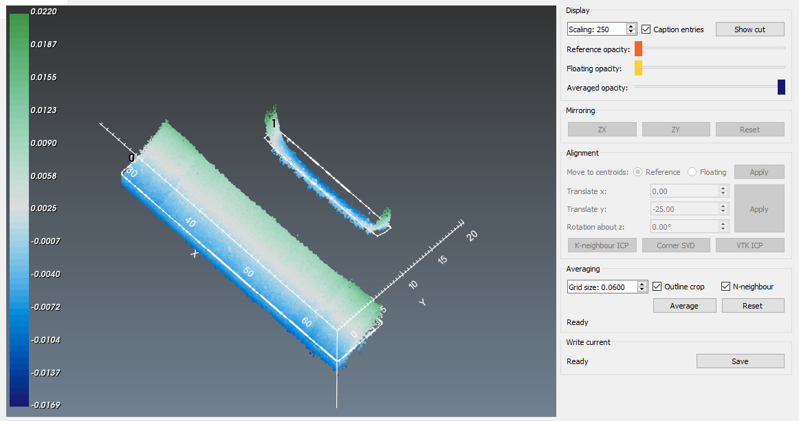

# align_average

## Background
Performing a contour method generates two surfaces which need to be aligned and then averaged to eliminate/minimize cutting artefacts and eliminate shear effects.

This module allows for viewing the two surfaces, with one being a reference and the other the surface to be aligned and averaged (floating). The floating surface can be then mirrored, and aligned with the reference surface. Upon alignment, then the two surfaces are averaged along a common grid dictated by the extents of the reference surface outline.

## Initializing
There is one main GUI-enabled function, called `ali_avg_interactor`. This can be accessed by running `from pyCM import align_average`.

**Input and output descriptors for the align_average function**

Input | Description
---  |---
Input file	| A *.mat file containing two data structures needed for subsequent processing, *ref* and *float* which contain the following:<ul><li>x,y,z: N×1 arrays of the masked coordinate values. *this will be eliminated with the next refactor*</li><li>rawPnts: N×3 matrix of the points read in via the point cloud file.</li><li>mask: 1×N array of int8 values consisting of 0 and 1 where 0 indicates a masked point. Conversion to a boolean array will provide an index of rawPnts that were masked.</li><li>fname: file name of where the point cloud data was imported from </li><li>x_out: N×3 matrix of the points that comprise the outline</li></ul> 

Output | Description
---  |---
Aligned and averaged points | A variable called aa, which is an N×3 matrix of points comprising the aligned and averaged data. This matrix is added to the *.mat file which contained the originating data.
Transformation matrix | A variable called transM added to the *.mat results file. This is a 4×4 transformation matrix required to align the floating point cloud with the reference point cloud.

The function can be called from interactive Python according to:
~~~
>from pyCM import align_average
>ali_avg_interactor()
~~~
which will provide a GUI to locate the *.mat file with the floating and reference point cloud data, according to the description above.

##  Interaction functionality
The data will appear in a custom VTK interaction window after initializing. A set of axes is provided in the x and y directions to identify principle axes. The default view is looking down on the data in the z direction, after which the view can be rotated to show the data in perspective ([Fig. 1](#fig1)) by pressing the left mouse button. The middle mouse button provides a pan function while pressed, and the right mouse button zooms. There are three named views that are accessed via **1**, **2** and **3** looking down the z, x and y directions, respectively. 

  
* Figure 1: Loaded data with the reference set in orange and the floating data set in yellow.*

For publication purposes, the ability to flip the default color scheme (dark on bright) has been provided. This is obtained by pressing f on the keyboard. Again, for publication purposes, a facility has been provided for printing the interaction window to file. Pressing **i** will print the interaction window to the current working directory as ’Avg_aligned.png’.

As in other modules, a facility for increasing the aspect of the data has been provided, across all principle axes, according to the radio button selected. Pressing **z** increases the aspect ratio by 2x with each keypress, pressing **x** decreases by half, and **c** returns to the default aspect ratio.

Using the push buttons under the *Mirroring* pane will provide the ability to mirror the floating surface prior to alignment and averaging.

Alignment of the floating data to the reference is imposed either by the default outline data or the overall point cloud ([Fig. 3](#fig3)). This is accomplished via an iterative closest point technique, a pre-existing VTK filter. This filter seeks to match the vertex in one surface with the closest surface point in the other, then applying the transformation which best matches in a least-square sense, with 200 iterations.

  
* Figure 3: The floating data is aligned with the reference data. The reference surface remains orange.*

For large point clouds which are nearly aligned, the iterative closest point has been noted to occasionally fail as the error between the starting transformation and the final is near floating point accuracy. Therefore, an intermediate translation is possible by entering values for x and y translation and pressing the 'Translate' button ([Fig. 5](#fig5)).

  
* Figure 4: As an intermediate step prior to alignment, the floating dataset can be translated to provide the iterative closest point algorithm a steeper gradient for error tabulation.*

Once alignment has taken place, then averaging can take place by pressing the 'Average' button. The data will be gridded and averaged according to the mean point spacing in the reference point cloud ([Fig. 5](#fig5)).

  
* Figure 5: Reference, floating and aligned & averaged datasets shown in orange, yellow and light blue, respectively.*

Pressing the 'Write' button will write data to the orginating *.mat file. This *.mat file can be reloaded by pressing the 'Load' button as needed.

A complete list of interaction keys is provided below. 

**Keyboard and mouse mapping**

Key | Description
---  |---
Left mouse button 	|Rotate about the center of view
Middle mouse button 	|Pan
Right mouse button 	|Zoom/refresh window extents
1 	|View 1, default, looks down z axis onto xy plane
2 	|View 2, default, looks down x axis onto zy plane
3 	|View 3, default, looks down y axis onto zx plane
z 	|Increase z-aspect ratio by a factor of 2
x 	|Decrease z-aspect ratio by a factor of 0.5
c 	|Return to default z-aspect ratio; x,y:z=1:1
f 	|Flip colour scheme from bright on dark to dark on bright.
i 	|Save visualization window as ’Avg_aligned.png’ to the current working directory

## Performance
The current version of this module has been tested with point clouds containing approximately 50,000 points each. Mirroring, alignment, averaging and output were all found to be near instantaneous.

## Known issues

Loading of extremely large datasets has shown to create serious lag. Point clouds are better off sampled and reduced before using these tools. Not all hardware is supported; OpenGL errors have been noted when using 4k displays.