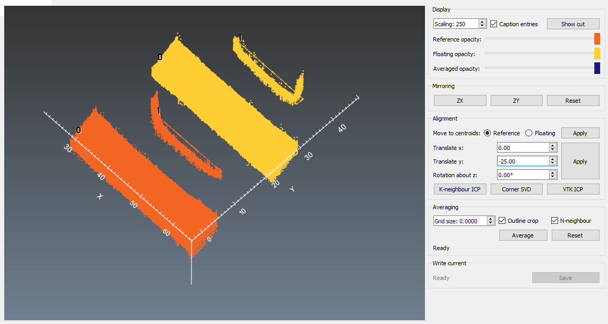

# align_average

## Background
Performing a contour method generates two surfaces which need to be aligned and then averaged to eliminate/minimize cutting artefacts and eliminate shear effects.

This module allows for viewing the two surfaces, with one being a reference and the other the surface to be aligned and averaged (floating). The floating surface can be then mirrored, and aligned with the reference surface. Upon alignment, then the two surfaces are averaged along a common grid dictated by the extents of the reference surface outline.

## Hierarchy

There is only one module and function `align_average`.

Import via `from pyCM import align_average`

## Initializing

**Input and output descriptors for the align_average function**

Input | Description
---  |---
Reference file |	 A *_mod.mat file. At minimum, it will contain the following variables:<ul><li>x,y,z: N×1 arrays of the coordinate values.</li><li>rawPnts: N×3 matrix the points read in via the point cloud file.</li><li>x_out, a 3×N matrix containing the surface outline </li></ul> 
Floating file |	Same criteria as the reference file.
Output directory |	Specification of where the processed *_avg.mat file is written. If not specified, the location is acquired via GUI.

Output | Description
---  |---
Output file	| A *_avg.mat file written to the specified output directory. It will contain the following <ul><li>xr,yr,zr,xf,yf,zf,x_out: 1×N arrays of the coordinates in the reference surface (r) and the aligned surface (f). The outline of the reference surface, x_out, is saved as a N×3 matrix. All of these values are stored in a structure called `ali`. </li><li>xi,yi,zi,in,pts: N×M matrices containing the gridded, averaged data, with pts an ungridded N×3 matrix of points contained by `x_out`. The variable `in` is an array of boolean values corresponding to a numpy index of points in the grid that is within `x_out`. All of these variables are stored in a structure called `avg`.</li></ul>

The function is currently called directly from the command line:
~~~
>python align_average.py RefTile FloatFile OutDir
~~~
Or from a python script according to:
~~~
import os

RefFile="FullPathToReference_mod.mat"
FloatFile="FullPathToFloat_mod.mat"
Ta=os.getcwd()

os.system("python align_average.py %s %s %s"%(RefFile,FloatFile,Ta))
~~~
with the above example suitable for using the current working directory as an output location for the _avg.mat file.

Running without inputs will provide a GUI to locate them, i.e.:
~~~
>python align_average.py
~~~

##  Interaction functionality
The data will appear in a custom VTK interaction window after initializing. A set of axes is provided in the x and y directions to identify principle axes. Note that while the data appears in the interaction window centred on respective centroids, the output will *not* be. The floating data is currently hardcoded to appear 40 mm above the reference surface. The default view is looking down on the data in the z direction, after which the view can be rotated to show the data in perspective ([Fig. 1](#fig1)) by pressing the left mouse button. The middle mouse button provides a pan function while pressed, and the right mouse button zooms. There are three named views that are accessed via 1, 2 and 3 looking down the z, x and y directions, respectively. 

  
* Figure 1: Loaded data with the reference set in orange and the floating data set in yellow.*

For publication purposes, the ability to flip the default color scheme (dark on bright) has been provided. This is obtained by pressing f on the keyboard. Again, for publication purposes, a facility has been provided for printing the interaction window to file. Pressing i will print the interaction window to the current working directory as ’Avg.png’.

In order to mirror the data, pressing either h or k on the keyboard will mirror the floating data about the x or y axis, respectively.
  

  
* Figure 2: The floating data can be mirrored about the x or y axis by pressing h or l on the keyboard.*

As in other modules, a facility for increasing the z-aspect of the data has been provided. Pressing z increases the aspect ratio by 2x with each keypress, pressing x decreases by half, and c returns to the default aspect ratio. Point size modifications are not currently mapped.

Alignment of the floating data to the reference is imposed by pressing a on the keyboard ([Fig. 3](#fig3))). This is accomplished via an iterative closest point technique, pre-existing as a VTK filter. Note that any scaling imposed will automatically be removed prior to this occurring.

  
* Figure 3: The floating data is aligned with the reference data and appears as light yellow, with the original position shown in darker yellow. The reference surface remains orange.*

Once alignment has taken place, then averaging can take place by pressing Shift-a. The viewport will update when this is complete ([Fig. 4](#fig4)).

  
* Figure 4: Reference, floating, aligned floating and averaged datasets shown in orange, yellow, light yellow and light blue, respectively.*

Pressing e will then write the *_avg.mat file using the prefix of the point cloud file containing the points considered, the mask, the masked points and perimeter (if available) to the specified output directory. If the alignment has not taken place, then no data will be written. The interaction window will then close.

A complete list of interaction keys is provided below. 

**Keyboard and mouse mapping for the pyCM point_cloud module**

Key | Description
---  |---
Left mouse button 	|Rotate about the center of view
Middle mouse button 	|Pan
Right mouse button 	|Zoom/refresh window extents
1 	|View 1, default, looks down z axis onto xy plane
2 	|View 2, default, looks down x axis onto zy plane
3 	|View 3, default, looks down y axis onto zx plane
z 	|Increase z-aspect ratio by a factor of 2
x 	|Decrease z-aspect ratio by a factor of 0.5
c 	|Return to default z-aspect ratio; x,y:z=1:1
r 	|Remove/reinstate axes
f 	|Flip colour scheme from bright on dark to dark on bright.
i 	|Save visualization window as ’Avg.png’ to the current working directory
h 	|mirror on x plane
k 	|mirror on y
d 	|flip visibility of reference and floating point clouds/outlines
a 	|align
Shift+a 	|average
e 	|Update output file, write output and exit.

## Performance
The current version of this module has been tested with point clouds containing approximately 50,000 points each. Mirroring, alignment, averaging and output were all found to be near instantaneous.

## Known issues

Loading of extremely large datasets has shown to create serious lag. Point clouds are better off sampled and reduced before using these tools. Not all hardware is supported; OpenGL errors have been noted when using 4k displays.