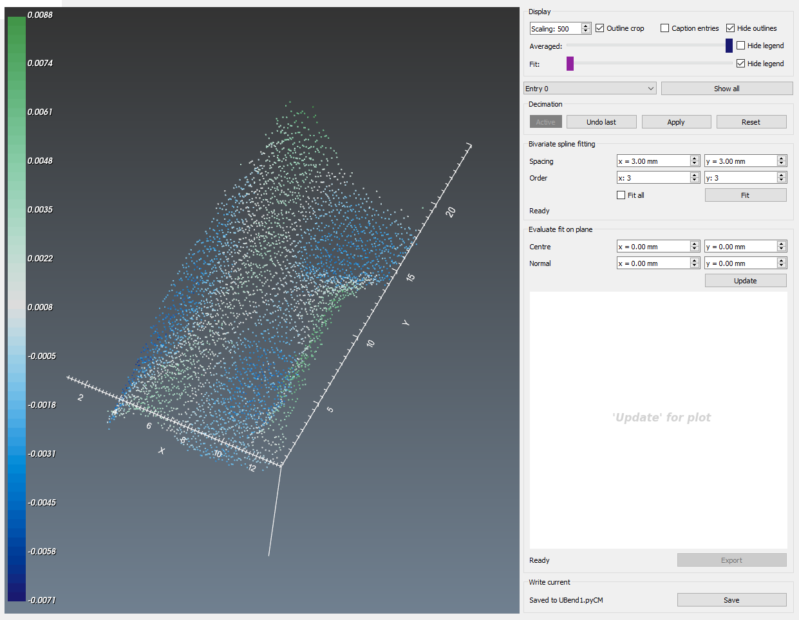
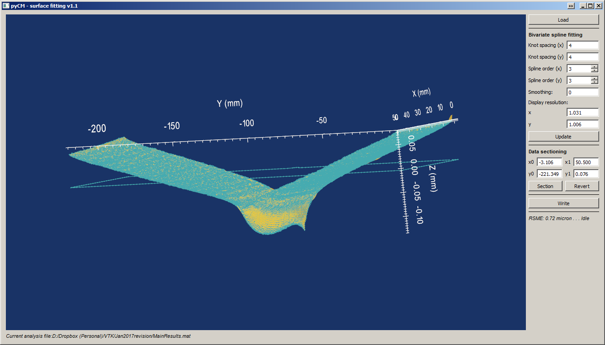
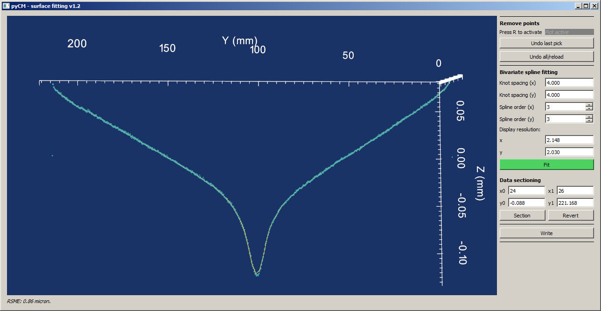

# fit_surface

## Background
Reads data from the align & average step and provides a GUI which is essentially a wrapper for [Scipy's FITPACK bivariate spline fitting function](https://docs.scipy.org/doc/scipy-0.14.0/reference/generated/scipy.interpolate.bisplrep.html#scipy.interpolate.bisplrep). Writes to a results *.mat file containing the spline fit both from FITPACK as well as attempting to match [MATLAB's spline objects](https://uk.mathworks.com/matlabcentral/linkexchange/links/116-mathworks-spline-toolbox).

## Initializing

**Input and output descriptors**
Input | Description
---  |---
Input file	| A *.mat file with a `ref` structure containing an `x_out` field, see [point_cloud](point_cloudREADME.md): Nx3 matrix of the points that comprise the outline, and a matrix `aa`, which is an Nx3 matrix of points comprising the aligned and averaged data -  see [align_average](align_averageREADME.md).

Output | Description
---  |---
Spline data structure | A `spline_x` structure written to the *.mat results file which contains the following fields:<ul><li>`knots`: Nx2 cell arrays of knots in the x & y directions, respectively.</li><li>`dim`: dimension of the spline (required for MATLAB interoperability)</li><li>`form`: form of the spline - defaults to 'B-' (required for MATLAB interoperability)</li><li>`number`: Nx2 the number of knots in x and y, respectively (required for MATLAB interoperability)</li><li>`tck`: FITPACK generated spline information, a list that contains the knots, coefficients and order.</li><li>`coefs`: matrix of coefficients with dimensions of dimxNxM, according to the dimension, x and y directions (required for MATLAB interoperability)</li></ul> 

Called from Python according to:
~~~
from pyCM import fit_surface as fs
fs.sf_def()
~~~
which will provide a GUI to locate the *.mat file with the floating and reference point cloud data, according to the description above. Alternatively, the path to the target *.mat file can be specified directly:
~~~
from pyCM import fit_surface as fs
fs.sf_def('PathToMatFile.mat')
~~~

##  Interaction functionality
On launching, a custom interactor is generated ([Fig. 1](#fig1)) which permits the same types of manipulation as other pyCM tools in terms of view manipulation. The **z**, **x** and **c** keys only affect the aspect in the z direction, however.

  
* Figure 1: Loaded data with the reference outline and aligned and averaged data set shown.*

Here, the user has access to all arguments to the main arguments of the [scipy.interpolate.bisplrep](https://docs.scipy.org/doc/scipy-0.14.0/reference/generated/scipy.interpolate.bisplrep.html#scipy.interpolate.bisplrep) function via input boxes. Pressing the 'Update' button will both fit and display the result based on the selected parameters ([Fig. 2](#fig2)). The 'Display resolution' pane permits the user to view the fit of the spline with a higher resolution, and ensure that the point cloud is effectively fitted in all areas. If the display resolution isn't set, half of the knot spacing in either direction is employed.

  
* Figure 2: Fitted spline with a non-default resolution.*

For further examination of the fit in all locations of the point cloud, the spline/point cloud can be sectioned, by using the 'Data sectioning' pane. An example of this is shown in [Fig. 3](#fig3). This can be done as many times as needed, the 'Revert' button will undo all sectioning.

  
* Figure 3: Sectioned spline compared to the point cloud.*

Pressing the 'Write' button will update the *.mat file with the result of the spline. Another file can be read in by pressing load, or the fitting process can be repeated by pressing the 'Load' button.

**Keyboard and mouse mapping**

Key | Description
---  |---
Left mouse button 	|Rotate about the center of view
Middle mouse button 	|Pan
Right mouse button 	|Zoom/refresh window extents
1 	|View 1, default, looks down z axis onto xy plane
2 	|View 2, default, looks down x axis onto zy plane
3 	|View 3, default, looks down y axis onto zx plane
z | increase z-aspect ratio
x | decrease z-aspect ratio
c | return to default z-aspect
f | flip colors from white on dark to dark on white
i | save output to spline_fit.png in current working directory
r | remove/reinstate compass/axes
o | remove/reinstate outline

## Known issues
None at this time.