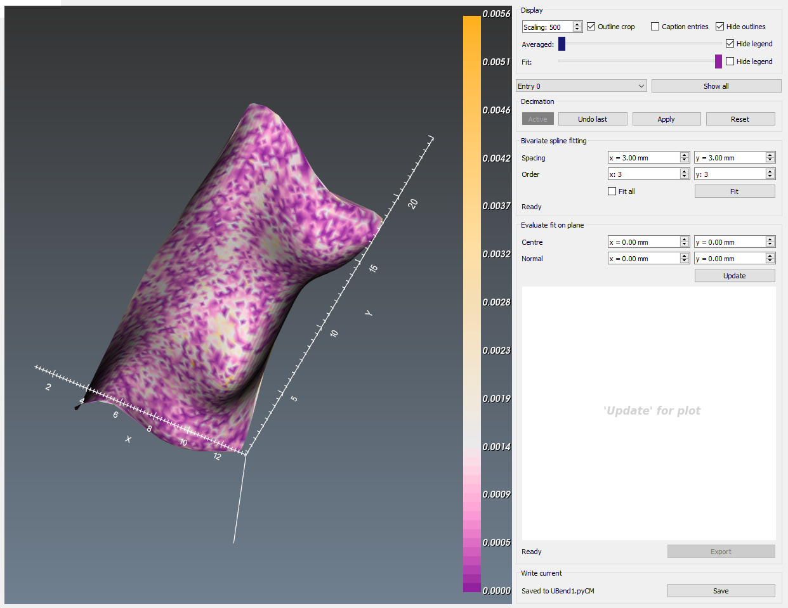
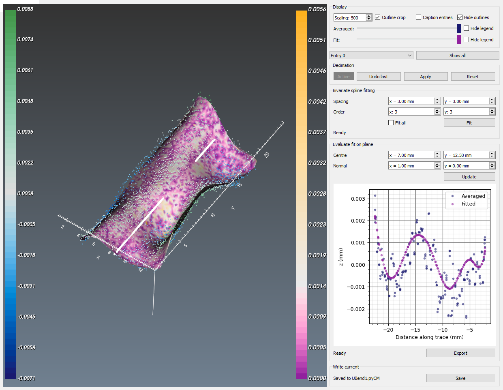

# fit_surface

## Background
This function reads data from the alignment and averaging step, providing a GUI which currently is only a wrapper for [Scipy's FITPACK bivariate spline fitting function](https://docs.scipy.org/doc/scipy-0.14.0/reference/generated/scipy.interpolate.bisplrep.html#scipy.interpolate.bisplrep). It is feasible in the future to include more surface fitting tools, but at this stage only bivariate splines are supported.

## Initializing

This function can be called independently by importing the fit_surface module from pyCM and then calling launch:

~~~
>>>from pyCM import fit_surface as fs
>>>fs.launch()
~~~

Then, upon launching, the pyCM data file can be loaded via a GUI by pressing the `l` key if launched independently, or by specifying the file directly i.e. `fs.launch('full_path_to_file.pyCM')`. If using the pyCM [main](mainREADME.md) function, `Shift+l` will load any data from the active file. This results in a populated widget as shown in [Fig. 1](#fig1).

  
* Figure 1: Surface fitting widget showing a loaded pyCM file containing data from the averaging and alignment step.*

This file must contain the following:

Input | Description
---  |---
Aligned and averaged points | A structure called `aa`, which contains the fields `pnts` - Nx3 matrix of points comprising the aligned and averaged data and `grid_size` as an attribute - the characteristic length of the grid that was used to average the data.

## Display
Controls over scaling of all entries is provided by `Scaling`, identical to both [registration](registrationREADME.md) and [align_average](align_averageREADME.md). Options for cropping the fitted surface to the outline is provided by the `Outline crop` checkbox (off by default). Captioning entries can be activated by the `Caption entries` checkbox (off by default), and outlines can be hidden by the `Hide outlines` (on by default) checkbox. Opacity controls for both the averaged surface and fitted surface along with the visibility of their legends is also provided.

Since seperate fits can be applied to different entries in the overall dataset, a drop-down menu for focussing on which entry to be considered is provided. Activating this drop-down on an individual entry will hide the other entries and focus on the one specified. `Show all` reverts back and shows all entries.

## Decimation
The facility to decimate points in the averaged point cloud in order to deactivate them from being included in the fit is provided here. This operates on an identical principal to that employed in the registration step - see *Editor - Decimation* under [registration](registrationREADME.md).

## Bivariate spline fitting
In order to fit an entry, first select the entry to be focussed on by using the drop-down menu directly above the decimation panel. Then, the spline spacing and order can be specified, prior to attempting a fit with the `Fit` button. If all entries are to have the same fit parameters applied, then the `Fit all` checkbox can be actuated (off by default). Messages regarding the fit process are provided at the bottom of the panel.

When the fit completes, then the display will be updated with the fitted surface, coloured according to the root square error between averaged data and the fit ([Fig. 2](#fig2)).

  
* Figure 2: Surface fitting widget showing a fitted surface.*

## Evaluate fit on plane
Beyond a contour map of the root square error, the fit can be evaluated on a plane. This plane is specified by the xy position of the centre, and the terminating point of the normal originating from x,y = 0. A plot is provided showing the averaged data, along with the fit as projected on this plane in an embedded plot with the `Update` button. See ([Fig. 3](#fig3)) for an example.

  
* Figure 3: Surface fitting widget showing the averaged point cloud coloured according to height, the fitted surface coloured according to the root mean square error, a white line showing the surface trace and the data from both the averaged point cloud as well as the fitted surface along this trace.*

The data in the plot window can be exported to a *.csv file for further analysis with the `Export` button.

## Write current
When data has been fitted, then the `Write current` panel will be active. The save process is identical to that applied by [align_average](align_averageREADME.md). The following is what is added to the pyCM data file by this step.

Output | Description
---  |---
Fit data structures | A `fit` structure containing the following fields on a per entry basis:<ul><li>`active`: An integer array of points indexing which points are actively being considered.</li><li>`bv_tck`: a list of spline parameters; the 5 entries corresponding to [tck](https://docs.scipy.org/doc/scipy/reference/generated/scipy.interpolate.bisplev.html), along with grid spacing in x and y, at index 5 and 6, respectively.</li><li>`eval_points`: points that have been considered as part of the fit</li></li><li>`rse`: calculated root square error between the spline and eval_points</li><li>`tri`: a 2D Delaunay triangulation of eval_points for the purposes of displaying a contour plot of the root square error</li></ul>

## Keyboard and mouse mapping

Key | Description
---  |---
Left mouse button 	|Rotate about the center of view
Middle mouse button 	|Pan
Right mouse button 	|Zoom/refresh window extents
1 	|View 1, default, looks down z axis onto xy plane
2 	|View 2, default, looks down x axis onto zy plane
3 	|View 3, default, looks down y axis onto zx plane
z | increase z-aspect ratio
x | decrease z-aspect ratio
c | return to default z-aspect
a | remove/reinstate compass/axes
o | remove/reinstate outline
l | load/reload *.pyCM file

## Known issues
None at this time.