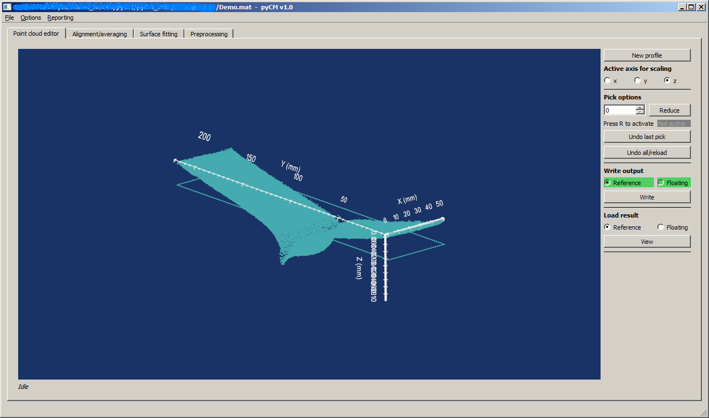
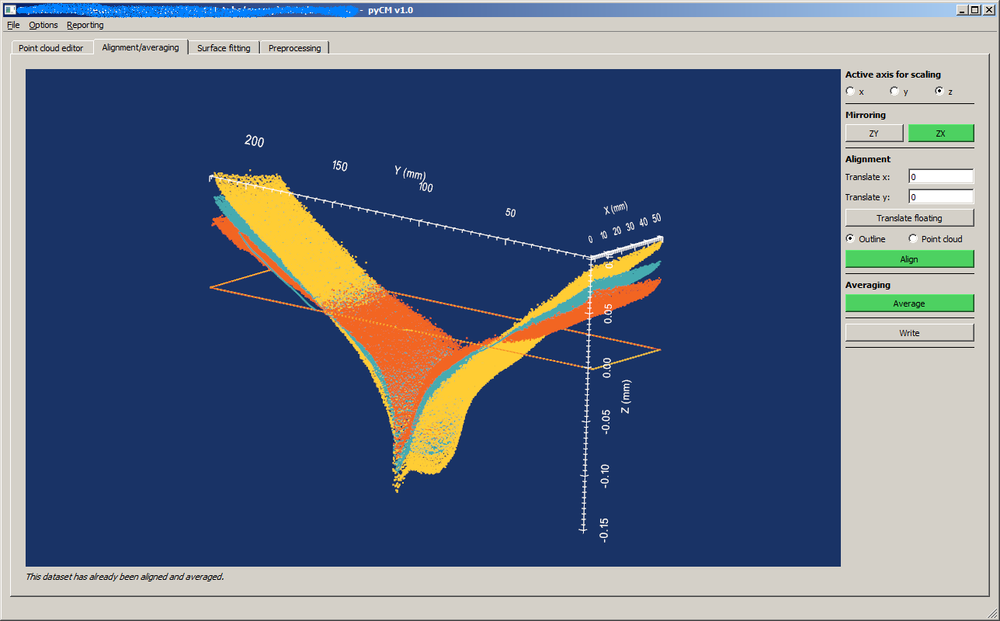
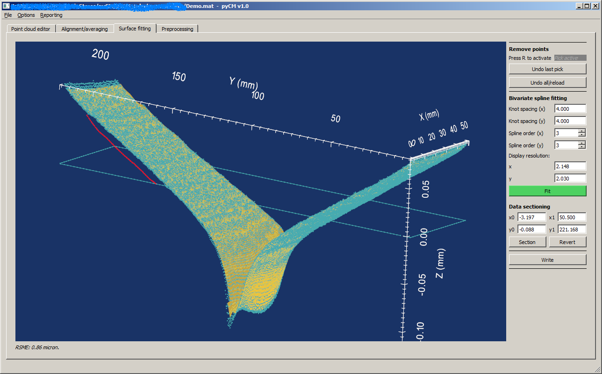
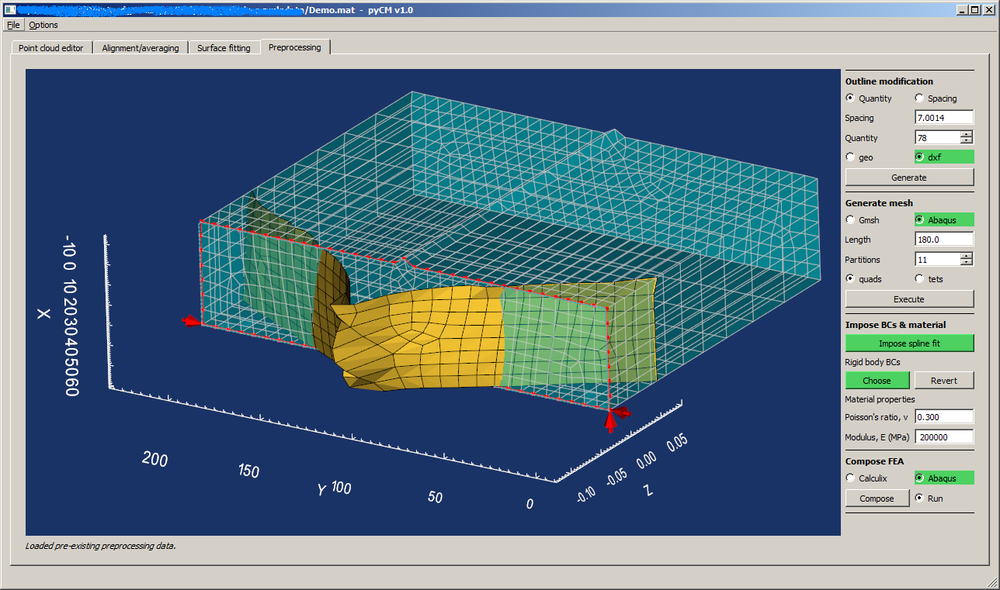

# main

## Background
Tabbed interface which groups all steps of the contour method together to read and write a common datafile, along with collating all finite element analysis files.

## Initializing

Once pyCM has been installed, this GUI interface can be launched by typing
~~~
python -m pyCM.main()
~~~
from a command line. This will launch the `main` script which in turn calls all other step-specific applications in discrete tabs. To read more about the functionality of each tab, see below where links to each respective step reside. 

## Menu
At this time, the drop down menu is sparsely populated, with the only functionality being the ability to:

* To load a pyCM results file with a *.mat extension (File)
* Change FEA working directory (Options)
* Change FEA executable paths(Options)

## Point cloud editor tab

The first tab is the point cloud editor which is required to start an analysis. To do so, all that is required is the same data types described in [point_cloud](point_cloudREADME.md). 

  
* Figure 1: Loaded data with the point cloud editor active. Green highlights that both a reference and floating point cloud has been processed and saved.*

## Alignment and averaging tab

The second tab uses the masked point clouds generated in the point cloud editor and allows the user to mirror, align and average them, as well as identifying which point cloud/outline combination is the reference and the floating datasets. For more information, see  [align_average](align_averageREADME.md). 

  
* Figure 2: Loaded data with the alignment and averaging editor active. Green highlights that the dataset has been mirrored (and on what plane) as well as aligned and averaged.*

## Surface fitting tab

The third tab permits the user to fit an analytical surface to the aligned and averaged surface generated in the previous step. See [fit_surface](fit_surfaceREADME.md). 

  
* Figure 3: Loaded data with the surface fitting editor active. Green highlights that the averaged dataset has been fitted, along with the parameters used for the fit.*

## FEA preprocessing tab

This tab currently permits a user to refactor (seed) an outline, generate a mesh, and subsequently assign boundary conditions as dictated by the analytical surface found in the previous step. See [preprocess](preprocessREADME.md).

  
* Figure 4: Loaded data with the preprocessor editor active. Green highlights which route has been selected for generating a mesh and the subsequent finite element analysis.*

## Known issues
Over-writing of data is still possible at this stage, it is recommended that the user works from a copy of a database file if any changes are to be experimented with, or if a sensitivity analysis is to be conducted. Changes in the analysis stream will not necessary negate results upstream, and therefore the user is advised to be cautious when using this tool. It has largely been written to a) perform an analysis in one direction along the analysis path, and b) playback analyses that have been conducted.

The VTK interactor does not refresh automatically upon interface resizing, zooming will allow it to refresh.