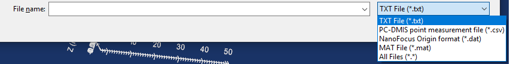
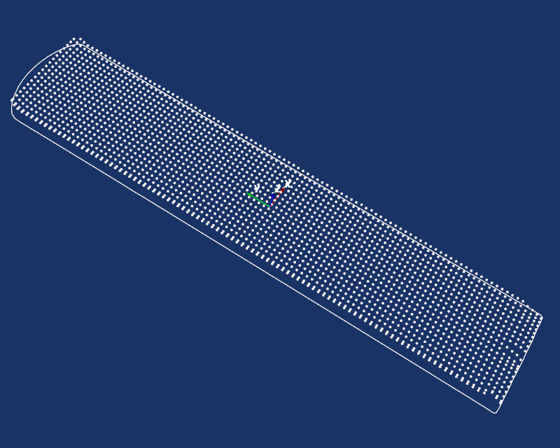
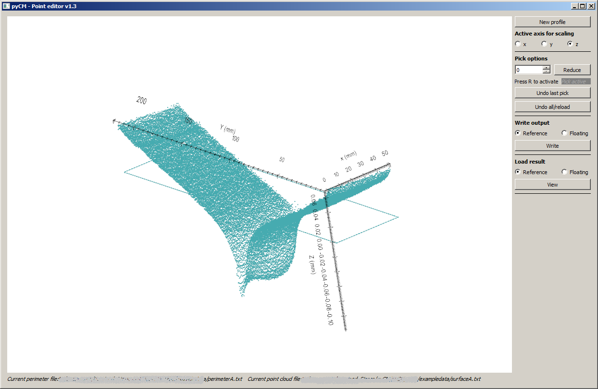
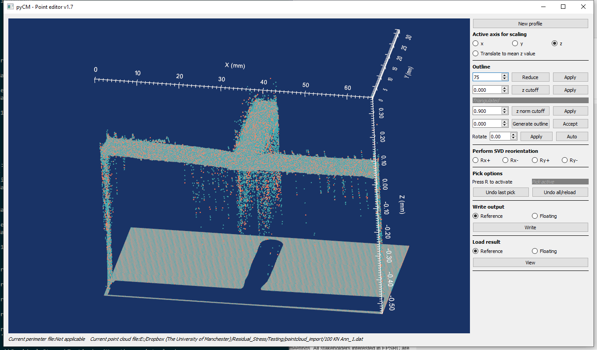
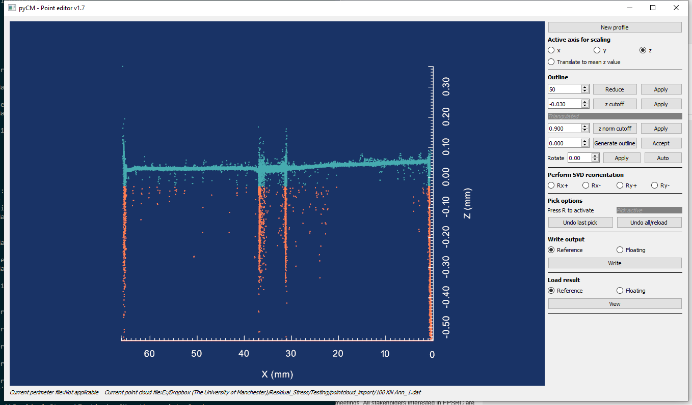
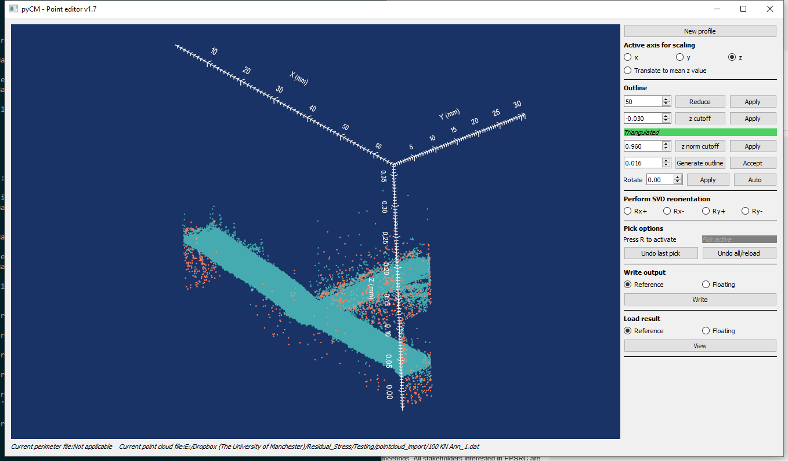
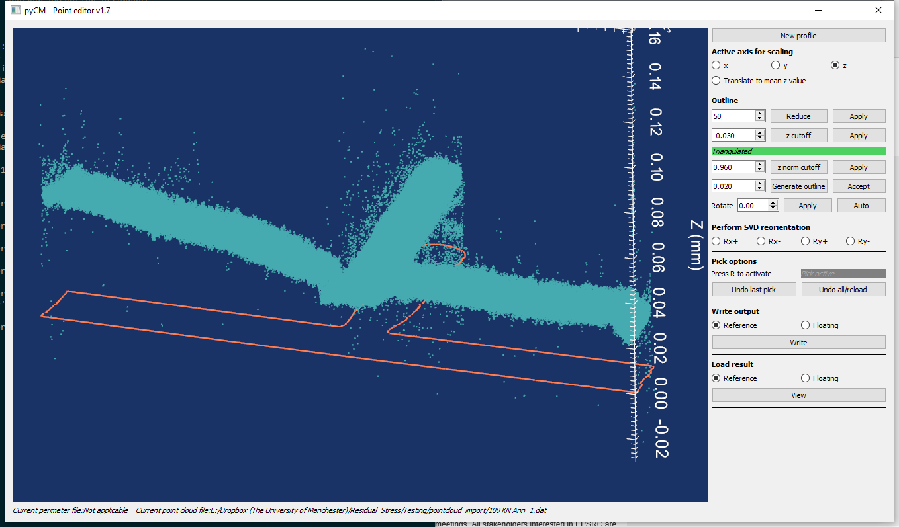
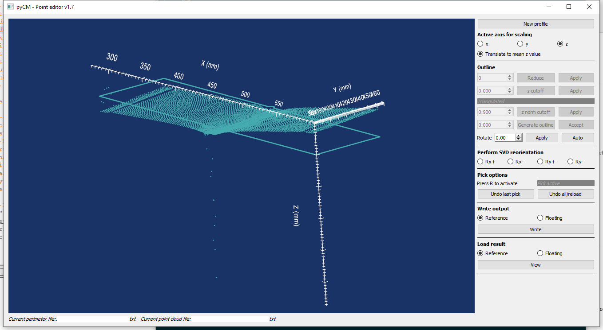
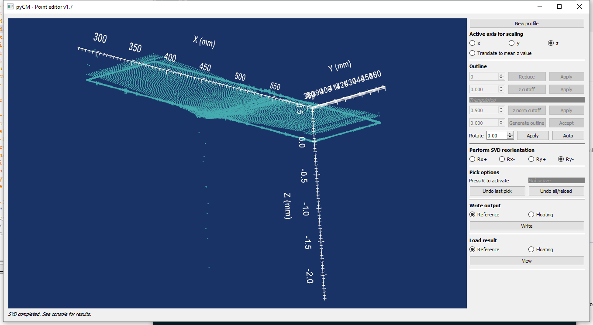
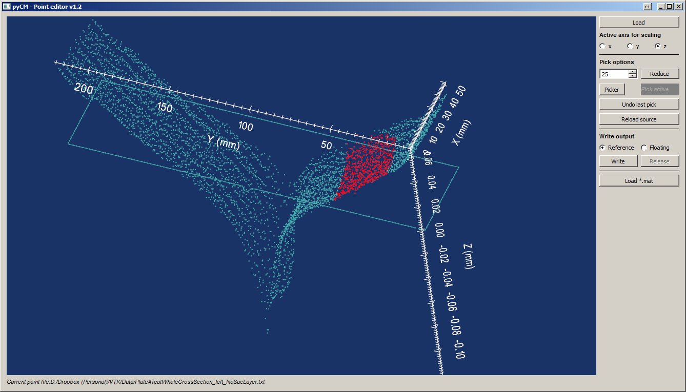

# point_cloud

## Background
It has been found that it is occasionally necessary to mask point clouds in advance of alignment and averaging. Often spatial filtering is not completely effective in removing spurious points, or there are portions of a surface measurement result that the analyst does not want to consider. In the latter case, this includes cutting wire entry/exit artefacts, localized plasticity effects near restraint features and so on.

A tool has been developed to perform this type of masking, called point_cloud. It is intended to operate on two types of data:

1. Point clouds generated by laser profilometry after primary processing such that they can be segregated into a discrete outline and surface point cloud as text/whitespace delimited files
2. Point clouds generated by Coordinate Measurement Machines (CMMs) as primary processing

The function allows a user to load and visualize a point cloud, select points to be deleted and then write an output file containing the point locations and whether they were masked. This function will delete points, and steps which this occur are identified.

## Initializing
Analysis starts with loading the perimeter and point cloud for each surface.

**Input and output descriptors for the `mask_def` function**

Input | Description
---  |---
Perimeter file |	Text files and PC-DMIS comma seperated variable files permitted. If not specified directly, location is acquired via GUI.
Point cloud file |	Text,  PC-DMIS comma seperated variable and MAT-files are supported. Path dependencies are the same as the perimeter file. If not specified directly, location is acquired via GUI.

**OR**

Input | Description
---  |---
Raw point cloud file |	NanoFocus-type `*.dat` files in `Origin` format are supported. If not specified directly, location is acquired via GUI.

The most common/default way of importing data is via text files with whitespace (standard) or three comma separated variables - note both have a `.TXT` or `.txt` extension. Basically, these are .xyz files without normals. For example:

'0.095155   -43.346  1.5185	
0.097489   -53.637   1.5185	
...   ...   ...	'

or

'0.095155, -43.346, 1.5185	
0.097489, -53.637, 1.5185	
...   ...   ...	'

The other format is a `*.csv` file that can be imported into *non*-DMIS packages such as (confusingly) PC-DMIS, MCOSMOS, Calypso etc. Note that a complete programme will need to be created such as probe selection, intermediate points and so on. The file will contain an appropriate header along with labels according to:

|TYPE	|NAME	|X			|Y		|Z		|I	|J	|K|
|--- |---|---|---|---|---|---|---|
|POINT	|PNT1	|0.092801	|-48.491|1.5185	|0	|0	|1|
|POINT	|PNT2	|0.095155	|-43.346|1.5185	|0	|0	|1|
|POINT	|PNT3	|0.097489	|-53.637|1.5185	|0	|0	|1|
|POINT	|PNTn	|...		|...	|...	|0	|0	|1|

Finally, a `*.dat` file that represents only surface data and *does not* contain an outline can be loaded. The format matches a NanoFocus `Origin` type output and is as follows:

|X/[µm]        	              |Y / [µm]      	              |z / [µm] |
|---|---|---|
|0.0000        	              |0.0000        	              |-542.4800|
|30.0000       	              |0.0000        	              |-542.4800|
|60.0000       	              |0.0000        	              |-542.4800|
|90.0000       	              |0.0000        	              |-542.4800|
|...		|...	|...	|

Specifying file types is accomplished either through the GUI ([Fig. 1](#fig1)) or specifying the extension directly.
  
* Figure 1: Selection options for raw data.*

Output | Description
---  |---
Output file	| A .mat file will be written to the specified output directory. At minimum, it will contain two data structures needed for subsequent processing, *ref* and *float* which contain the following:<ul><li>x,y,z: Nx1 arrays of the masked coordinate values.</li><li>rawPnts: Nx3 matrix of the points read in via the point cloud file.</li><li>mask: 1xN array of int8 values consisting of 0 and 1 where 0 indicates a masked point. Conversion to a boolean array will provide an index of rawPnts that were masked.</li><li>x_out: Nx3 matrix of the points that comprise the outline</li></ul> 

There is one main GUI-enabled function, called `mask_def` in this method. This function can also be called from the pyCM main routine, see [main](mainREADME.md).

The function is called from a Python script or in interactive mode, starting by importing point_cloud module from the pyCM package and then calling the `mask_def` function for example: 
~~~
>>> from pyCM import point_cloud as pc
>>> pc.mask_def()
~~~
This will launch two GUIs immediately to specify the perimeter file and point cloud files, starting in the  current working directory. Cancelling these GUIs will leave a blank interactor, which new files can be specified by selecting the **New profile** button. The **New profile** button can also be selected to switch to another dataset (*i.e.* switching between reference and floating point clouds. To load a pyCM results `*.mat` file, press the **L** key.

##  Interaction functionality
The data will appear in a custom VTK interaction window after initializing, with data appearingon a dark background. The default view is looking down on the data in the z direction, after which the view can be rotated to show the data in perspective ([Fig. 2](#fig2)) by pressing the left mouse button. The middle mouse button provides a pan function while pressed, and the right mouse button zooms. There are three named views that are accessed via `1`, `2` and `3` looking down the z, x and y directions, respectively. 

  
* Figure 2: Main default interaction window with a dark background and white data and annotations.*

For publication purposes, the ability to flip the default color scheme (dark on bright) has been provided. This is obtained by pressing f ([Fig. 3](#fig3)) on the keyboard. Again, for publication purposes, a facility has been provided for printing the interaction window to file. Pressing `i` will print the interaction window to the current working directory as `point_cloud.png`.

  
* Figure 3: Flipped colour scheme with a white background and black data and annotations. Pressing f on the keyboard when the window is in focus flips to and from this scheme.*

As contour data has dimensions that are sometimes orders of magnitude larger in x and y, a facility for increasing the x, y and z-aspect of the data has been provided, depending on the radio button selected at the left-hand side of the GUI. Pressing `z` increases the aspect ratio by 2x with each keypress, pressing `x` decreases by half, and `c` returns to the default aspect ratio. Data sets where there is an appreciable difference between the mean z value of the outline versus the point cloud can be corrected by selecting `Translate to mean z value`.

### Outline processing 
Some optical scanning does not encompass outline processing. Edge finding algorithms borrowed from image processing techniques are only applicable to regularly ordered images (i.e. rectangular arrays of data that can be represented by pixels). The outline processing capabilities incorporated into pyCM rely on filtering points directly, or based on a triangulation and then concave hull processing using [Shapely](https://pypi.org/project/Shapely/). **Shapely will need to be installed in order to process any outlines from raw point clouds**.

The sequence can be first to reduce points reduce points by a percentage to speed up all subsequent processing steps: entering a value in the spinbox beside the `Reduce` button will identify the number of points to remove. For example, a value of 10 will remove 10% of the points. Note that these points which are removed are *not* shown as being masked (*i.e.* plotted as red points). *It is recommended that data be masked prior to performing SVD manipulation (see below) - only a few spurious points will have a large effect on the decomposition*.

  
* Figure 4: Previewing the removal of 25% of points by entering 75% and pressing `Reduce`*

Pressing `Reduce` will preview the points that will be removed by highlighting them in coral. Pressing `Apply` will engage them and they will **no longer be tracked as part of the analysis**.

Afterwards, applying a simple filter based on the z value to remove as many points as possible away from the target surface is implementd in the same manner. Points are identified as having a z coordinate less than a particular value are highlighted for elimination. Pressing `Apply` will engage and they will **no longer be tracked as part of the analysis**. 

  
* Figure 5: Previewing a z cutoff of points that are away from the main surface of interest.*

On the remaining points, a triangulation is carried out, and points comprising Delaunay triangulations which have z normal components less than a particular value are identified. This is to eliminate any points which are well on the edge(s) on the specimen. Different values of this normal can be previewed by pressing the `z norm cutoff` button once the triangulation has taken place. Applying the filter will necessitate a subsequent triangulation to run the same filter to re-calculate a valid triangulation. Pressing the `Apply` button will engage and any points highlighted will **no longer be tracked as part of the analysis**.

  
* Figure 6: Previewing points identified by the z normal cutoff filter.*

Finally, an outline can be generated by performing an alpha-shape type process on the remaining points. Experimentation with the threshold for the alpha shape is often necessary as too low will cause the routine to fail, and too high will generate too coarse a result. This is partilculary the case if the target outline has very concave features. Pressing `Accept` permits subsequent processing with the displayed outline.

  
* Figure 7: Previewing the outline generated by the alpha shape filter.*

*NB - unlike previous filters, this last outline calculation step can consider manually 'masked' points (e.g. only considers 'unmasked' points for the outline.*

### Data rotation
Misorientation during measurement may leave the specimen unaligned with a cardinal axis. The outline and point cloud can be rotated manually about the z axis by employing the `Rotate` functionality if and only if the `Reference` radio button for the *Write output* pane is selected. The `Auto` option will seek to rotate the data such that the longest dimention of the xy bounding box is aligned with the x axis.

### Single Value Decomposition reorientation
Particularly the case for data coming from coordinate measurement machines, occasionally data may be processed/examined when 'levelled'. The ability to rotate each point cloud according to the relevant component of an orthonormal decomposition has been provided. The `Rx` and `Ry` buttons rotate the relevant component of the surface's normals such that they are aligned with global x & y axes. [Fig. 8](#fig8) shows a surface in the as-measured state and the same after it has been rotated about the x & y axis to 'level' according to SVD orthonormals. *NB this SVD operation is carried out on masked data*. The status bar at the bottom of the interactor will confirm visual re-orientation success - actual rotations imposed are passed to the console. *NB the specific rotation applied is not stored, however the rotation applied is unique and converges meaning it is easily reproduced on raw data for replication purposes.*

  
  
* Figure 8: Results of rotating relevant component of orthonormal projection found by Single Value Decomposition. The dataset was rotated about the x and y axes by pressing `Rx` and `Ry` buttons: negative - clockwise, positive - counterclockwise)*

Masking of points to be discounted in the subsequent analysis can be accomplished with two techniques: a wholesale reduction of points, or more selectively with a picking tool. The `Pick options` pane's first option 

In order to select specific masked points, there is an interaction sequence which is triggered from the VTK interactor window. Pressing `r` will disable rotation such that using the left mouse button will enable the user to draw a rectangular window around points to be masked ([Fig. 5](#fig5)). This rectangle can be drawn and redrawn any number of times; panning and zooming are accessible by deactivating picking mode by pressing `r` once more. The *Pick active* pane will activate when the picker is active. This can be repeated any number of times. If a mistake is made, then the last pick can be undone with the `Undo last pick` button to deselect all highlighted points the last time the picker was active. Note that a hardware selection tool has been employed: only points that are visible in the particular view/orientation will be selected. If a mistake is made, then the entire dataset can be reloaded with the `Undo all/reload` button.

  
* Figure 5: Points to be eliminated/dismissed from subsequent analysis can be selected, as can the overall point cloud using the `Pick options` pane.*

Once the required points have been added to the mask, then the function can then write a `*.mat` file for the displayed perimeter/point cloud, targeting the structure identified with the radio button in the `Write output` pane. If this *.mat file has not been generated, then a GUI will prompt for a location. If there is already a Reference or Floating data series in the .mat file, the user will be asked if they wish to overwrite. If the reference or floating datasets need to be reviewed at any time, then the `Load result` panel can be employed to see what the .mat file currently contains in terms of a mask, outline and point cloud.

A complete list of interaction keys is provided below. 

**Keyboard and mouse mapping**

Key | Description
---  |---
Left mouse button 	|Rotate about the center of view
Middle mouse button 	|Pan
Right mouse button 	|Zoom/refresh window extents
1 	|View 1, default, looks down z axis onto xy plane
2 	|View 2, default, looks down x axis onto zy plane
3 	|View 3, default, looks down y axis onto zx plane
r 	|MaskDef Enter/exit picking mode, LMB is used to generate a selection window. Pressing key again exits selection mode and selected points will be highlighted.
z 	|Increase z-aspect ratio by a factor of 2
x 	|Decrease z-aspect ratio by a factor of 0.5
c 	|Return to default z-aspect ratio; x,y:z=1:1
o |Remove/reinstate outline
a 	|Remove/reinstate compass
f 	|Flip colour scheme from bright on dark to dark on bright.
i 	|Save visualization window as ’point_cloud.png’ to the current working directory

## Known issues

Loading of extremely large datasets (2M points or more) will diminish performance. Point clouds are better off sampled and reduced before using these tools. Not all hardware is supported; OpenGL errors have been noted when using 4k displays.