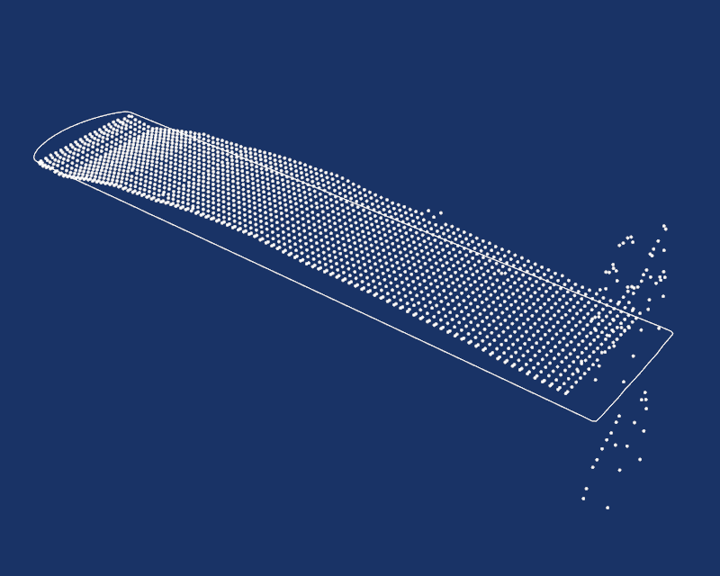
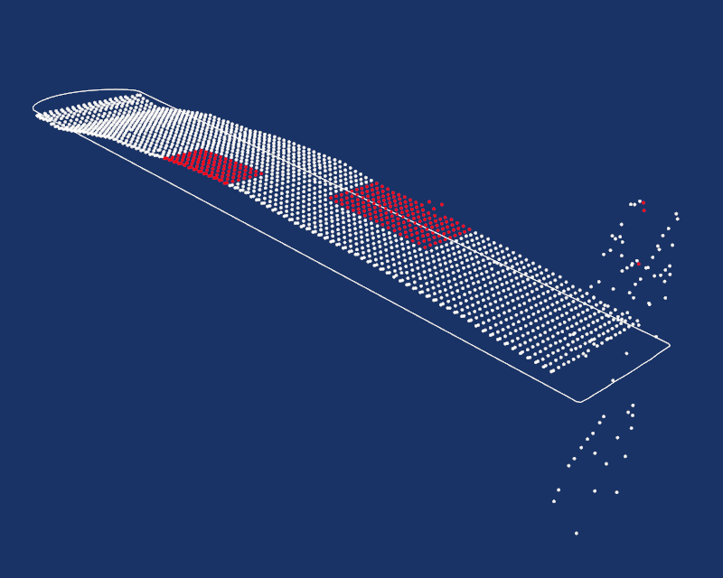

# point_cloud

## Background
It has been found that it is occasionally necessary to mask point clouds in advance of alignment and averaging. Often spatial filtering is not completely effective in removing spurious points, or there are portions of a surface measurement result that the analyst does not want to consider. In the latter case, this includes wire entry/exit artefacts, localized plasticity effects near restraint features and so on.

A tool has been developed to perform this type of masking, called point_cloud. It is intended to operate on two types of data:

1. Point clouds generated by laser profilometry after primary processing
2. Point clouds generated by Coordinate Measurement Machines (CMMs) as primary processing

The function allows a user to load and visualize a point cloud, select points to be deleted and then write an output file containing the point locations and whether they were masked. This function does not delete points, merely creates a new file containing this information. Currently, there is a function contained in point_cloud which generates masked data called `MaskDef`, and another called `ReadMask`.

## Hierarchy

* Module `point_cloud`
 - Function `MaskDef`
 - Function `ReadMask`

Import via `from pyCM import point_cloud`

## Initializing
Analysis starts with the MaskDef function. There are a variety of ways to call it; the following table describes the input and output formatting that will result.

**Input and output descriptors for the MaskDef function**

Input | Description
---  |---
Perimeter file |	*Optional*. Only text files are supported. A file name can be specified if its located in the current working directory, otherwise an absolute path is required.
Point cloud file |	Text, data and MAT-files are supported. Path dependencies are the same as the perimeter file. If not specified directly, location is acquired via GUI.
Output directory |	Specification of where the processed *_mod.mat file is written. If not specified, the location is acquired via GUI.

Output | Description
---  |---
Output file	| A *_mod.mat file written to the specified output directory. At minimum, it will contain the following variables:<ul><li>x,y,z: N×1 arrays of the masked coordinate values.</li><li>rawPnts: N×3 matrix the points read in via the point cloud file.</li><li>mask: 1×N array of int8 values consisting of 0 and 1 where 0 indicates a masked point. Conversion to a boolean array will provide an index of rawPnts that were masked.</li></ul> If a perimeter was read in either via a text file or was contained in the MAT-file, then an additional variable x_out will be written, a 3×N matrix. 

Incoming data can be in the form of a text, data or a MAT-file. These files must adhere to the following formatting requirements: 

**Input file formatting descriptors for the MaskDef function**

Input | Description
---  |---
Text file (*.txt)| 	Perimeter and point cloud files which are in the form of whitespace delimited coordinates, one point per line. Point files can have points listed in any order, perimeter files should be listed in a counter-clockwise fashion.
Data file (.dat) |	Reflects the NanoFocus whitespace delimited files, one point per line. The first row of these files which contain column headers is ignored.
MAT-files (.mat) |	MATLAB/Octave binary workspace files. These files must have at least four specific variable names: x, y, z and x_out. Variables x, y, z are 1×N arrays of equal length. The x_out variable should contain an outline in the form of an 3×N matrix, with x and y arranged in a counter-clockwise fashion about z . Alternatively, x_out can be empty, i.e. x_out=[]. If empty, then a perimeter will not be processed.

The function is called from a Python script or in interactive mode, starting by importing the specific module from the pyCM package as demonstrated above and then calling the MaskDef function via: 
~~~
MaskDef('Perim.txt','Points.txt','Output')
~~~
This will load the perimeter file located in the current working directory, the point cloud file with prefix 'Points' located in the same. Upon exiting, the function will write a 'Points_mod.mat' output file in a directory called Output located in the current working directory. If the 'Output' directory does not exist, it will create it. If there is an existing 'Output\Points_mod.mat' file, it will be overwritten. To ignore the perimeter: 
~~~
MaskDef('Points.txt','Output')
~~~
will perform the same, but will not write a x_out variable to the resulting 'Output\Points_mod.mat' file. Running without specifying the perimeter or output directory i.e.:
~~~
MaskDef('Points.txt')
~~~
will result in the same, but a GUI will appear asking for a directory to place 'Points_mod.mat'.

Specifying no inputs i.e.:
~~~
MaskDef()
~~~
will generate GUIs to obtain the location of an optional perimeter file, the mandatory point cloud file and finally the output directory. 

Copying point_cloud.py from the pyCM folder in the installation location to another location allows it to be run seperate from the package as a function. For example, running directly from the command line will call MaskDef directly: 
~~~
python point_cloud.py Perim.txt Points.txt Output
~~~
This allows the user to experiment with modifying the code in point_cloud.py without without affecting the installed version. 

##  Interaction functionality
The data will appear in a custom VTK interaction window after initializing, with data appearing in white (points) or lines on a dark background. A compass is also displayed at the point cloud’s centroid to identify principle axes. The default view is looking down on the data in the z direction, after which the view can be rotated to show the data in perspective ([Fig. 1](#fig1)) by pressing the left mouse button. The middle mouse button provides a pan function while pressed, and the right mouse button zooms. There are three named views that are accessed via 1, 2 and 3 looking down the z, x and y directions, respectively. 

  
* Figure 1: Main default interaction window with a dark background and white data and annotations. Perimeter is shown as a solid line, the compass appears at the centroid of the point cloud.*

For publication purposes, the ability to flip the default color scheme (dark on bright) has been provided. This is obtained by pressing f ([Fig. 2](#fig2)) on the keyboard. Again, for publication purposes, a facility has been provided for printing the interaction window to file. Pressing i; will print the interaction window to the current working directory as ’PointCloud.png’.

  
* Figure 2: Flipped colour scheme with a white background and black data and annotations. Pressing f on the keyboard when the window is in focus flips to and from this scheme.*

As contour data has dimensions that are sometimes orders of magnitude larger in x and y, a facility for increasing the z-aspect of the data has been provided. Pressing z increases the aspect ratio by 2x with each keypress, pressing x decreases by half, and c returns to the default aspect ratio ([Fig. 3](#fig3)). These same keys have been also mapped to increase/decrease the size of the points themselves: pressing Shift+z increases point size, Shift+x decreases it and Shift+c returns to default.

  
* Figure 3: Increased z-aspect ratio. Pressing z increases the aspect ratio by 2x with each keypress, pressing x decreases by half, and c returns to the default aspect ratio.*

In order to select masked points, there is an interaction sequence. Pressing p will disable rotation such that using the left mouse button will enable the user to draw a rectangular window around points to be masked. This rectangle can be drawn and redrawn any number of times; panning and zooming are still accessible. On pressing p again will select the points for the mask and highlight them ([Fig. 4](#fig4)). This can be repeated any number of times. If a mistake is made, then Shift+u can be used to deselect all highlighted points. Note that a hardware selection tool has been employed: only points that are visible in the particular view/orientation will be selected.

  
* Figure 4: Increased z-aspect ratio. Pressing z increases the aspect ratio by 2x with each keypress, pressing x decreases by half, and c returns to the default aspect ratio.*

Once the user is satisfied with the selected points, then pressing u will update the mask, removing the highlighted points from view. *Shift+u will not undo this operation*; it is up to the user to make sure that the selected points are accurate in advance of updating. The updated view can then have further points highlighted using the sequence described above, and further points can be removed. 

  
* Figure 5: Increased z-aspect ratio. Pressing z increases the aspect ratio by 2x with each keypress, pressing x decreases by half, and c returns to the default aspect ratio.*

Once the required points have been added to the mask (or masked points removed from view), then the function will then write the *_mod.mat file using the prefix of the point cloud file containing the points considered, the mask, the masked points and perimeter (if available) to the specified output directory on pressing e. The interaction window can be then closed.

A complete list of interaction keys is provided below. 

**Keyboard and mouse mapping for the pyCM point_cloud module**

Key | Description
---  |---
Left mouse button 	|Rotate about the center of view
Middle mouse button 	|Pan
Right mouse button 	|Zoom/refresh window extents
1 	|View 1, default, looks down z axis onto xy plane
2 	|View 2, default, looks down x axis onto zy plane
3 	|View 3, default, looks down y axis onto zx plane
p 	|MaskDef Enter/exit picking mode, LMB is used to generate a selection window. Pressing key again exits selection mode and selected points will be highlighted.
Shift+u| 	varf>MaskDef Soft undo, will deselect any highlighted points.
u 	|MaskDef Update. All highlighted points will be added to the mask and removed from the viewport.
z 	|Increase z-aspect ratio by a factor of 2
x 	|Decrease z-aspect ratio by a factor of 0.5
c 	|Return to default z-aspect ratio; x,y:z=1:1
Shift+z 	|Increase the size of points
Shift+x 	|Decrease the size of points
Shift+c 	|Return to the default point size
r 	|Remove/reinstate compass
f 	|Flip colour scheme from bright on dark to dark on bright.
i 	|Save visualization window as ’PointCloud.png’ (MaskDef) or 'MaskedPointCloud.png' (ReadMask) to the current working directory
e 	|MaskDef Write output file to the specified output directory.

## Working with masked data

In order to view or bring data written by MaskDef into Python interactively, the function ReadMask can be employed. 

**Keyboard and mouse mapping for the pyCM point_cloud module**

Input | Description
---  |---
Data file	|Only MAT-files with the same format (variable names and arrangement) as those generated by MaskDef are valid.
Suppression argument	| *Optional*. Will suppress a VTK window from appearing.

Output | Description
---  |---
ReadPoints	|N×3 array of masked points
ReadMask	|A array of boolean data types corresponding to RawPnts; 'False' indicates that the point is inactive.
RawPnts	|N×3 array of raw points 

Calling ReadMask can be accomplished via: 
~~~
p,rm,rp=ReadMask('SomeFile_mod.mat')
~~~

which will show the masked data set in a VTK window. Once the window is closed, then the masked points are returned to p, the mask to rm and raw points to rp, in this order. To suppress the VTK window: 
~~~
p,rm,rp=ReadMask('SomeFile_mod.mat',1)
~~~
To return all three output datatypes to a single list and suppress the output window: 
~~~
l=ReadMask('SomeFile_mod.mat',1)
~~~
To obtain only the masked points (and suppress the output window):
~~~
p=ReadMask('SomeFile_mod.mat',1)[0]
~~~
and by replacing [0] with [1] or [2] will return the other output variables available.

## Known issues

Loading of extremely large datasets has shown to create serious lag. Point clouds are better off sampled and reduced before using these tools. Not all hardware is supported; OpenGL errors have been noted when using 4k displays. 