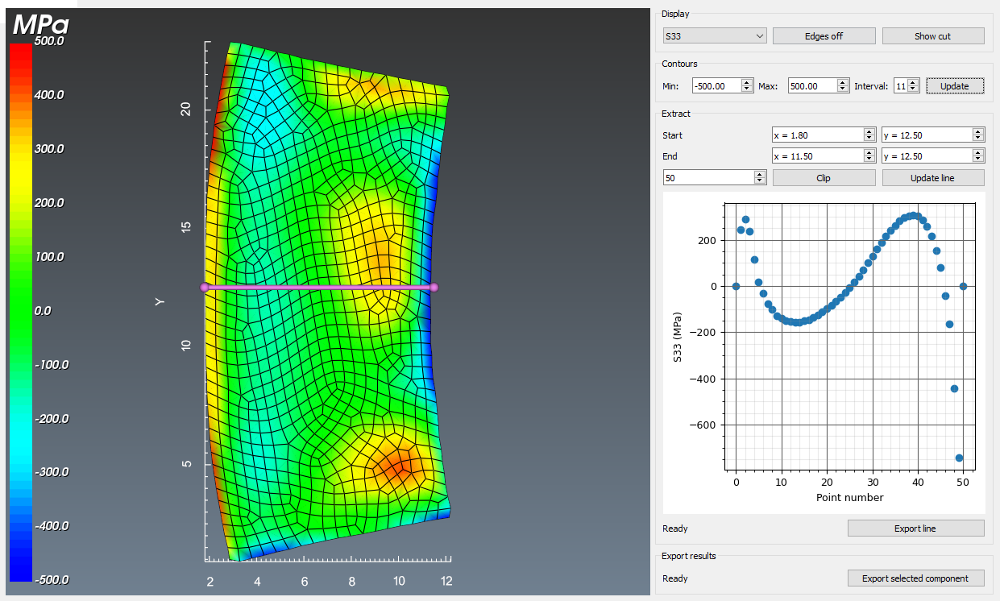

# postprocess

## Background
This is a function for both viewing and exporting output from the linear elastic Finite Element Analysis of the contour method.

## Initializing

This function can be called independently by importing the preprocess module from pyCM and then calling launch:

~~~
>>>from pyCM import postprocess as post
>>>post.launch()
~~~

Then, upon launching, the pyCM data file can be loaded via a GUI by pressing the `l` key if launched independently, or by specifying the file directly i.e. `post.launch('full_path_to_file.pyCM')`. If using the pyCM [main](mainREADME.md) function, `Shift+l` will load any data from the active file. This results in a populated widget as shown in [Fig. 1](#fig1).

  
* Figure 1: Postprocessing widget displaying a loaded pyCM file with S33 data being shown.*

This pyCM file must contain the following at minimum:

Input | Description
---  |---
Mesh information | A `mesh` strucutre with fields/groups correspoinding to an unstructured grid with point data. This includes `points`: node locations, `cells`: element connectivity, `cell_types`: an array of VTK cell (elements) types, `cell_locations`: cell/element numbering. A final group `point_data` containing entries for `S11`, `S22` and `S33` - stresses relieved by the cut in the x and y directions, as well as the full stress component acting in the z direction, respectively.

## Display
The stress component to be displayed can be selected with the drop-down menu. Default components which are tabulated by pyCM is `S11`, `S22` and `S33`. The default shown is `S33`, as this is a complete component that is rendered by pyCM.

The element edges of the mesh can be turned off and on by actuating `Edges off` (on by default), and if implemented in the registration step, the reference cutting orientation display can be toggled with `Show cut`.

## Contours
The ability to change the thresholds for contour levels on the legend can be effected here, as well as the number of intervals by making changes and pressing `Update`. Note that these reset on changing the stress component viewed under `Display`.

## Extract
The ability to perform a line trace over the cut profile to gather stress values as a funciton of distance is possible. Entering in the start and end point of the line with the `Start` and `End` and then `Update line` will plot this data in an embedded graph. The `Clip` button will clip the displayed mesh on a plane defined by this line and the z normal direction. This is to observe/characterise subsurface die-back lengths and ensure that the result is valid. To reverse clipping/reset the view, change the stress component under `Display`.

The `Export line` button permits exporting the data represented by the line in the form of a *.csv file with the output format being x and y location along with the stress component active when selected.

## Export results
The `Export selected component` button will generate a *.csv file which contains **all* x and y locations of the contour surface nodes along with the active stress component at that location. Note that very dense meshes may create a very large file and this may take a while to complete.

## Keyboard and mouse mapping

Key | Description
---  |---
Left mouse button 	|Rotate about the center of view
Middle mouse button 	|Pan
Right mouse button 	|Zoom/refresh window extents
1 	|View 1, default, looks down z axis onto xy plane
2 	|View 2, default, looks down x axis onto zy plane
3 	|View 3, default, looks down y axis onto zx plane
i | Save interactor to pyCM_capture.png in the current working directory
l | load/reload *.pyCM file to conduct/review/revise this analysis step

## Known issues
None at this time.