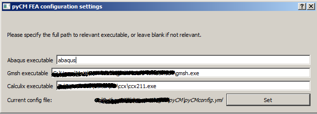
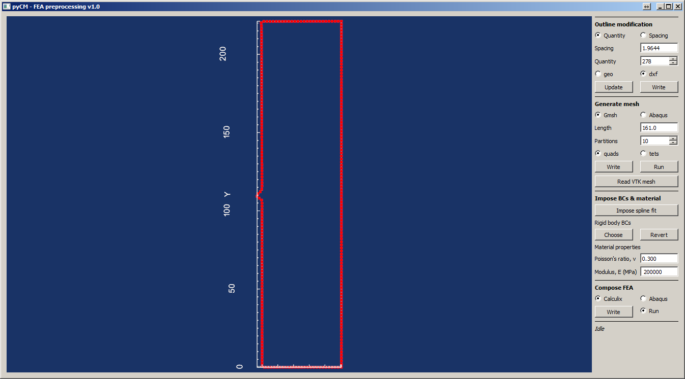
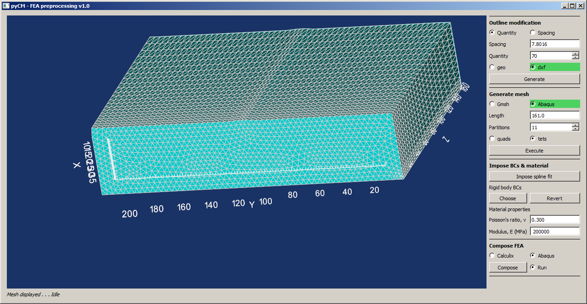
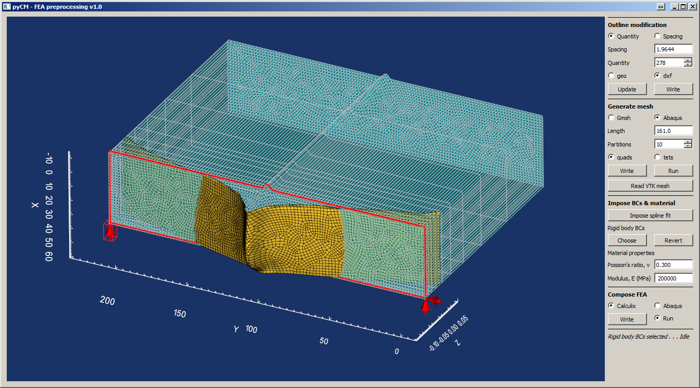
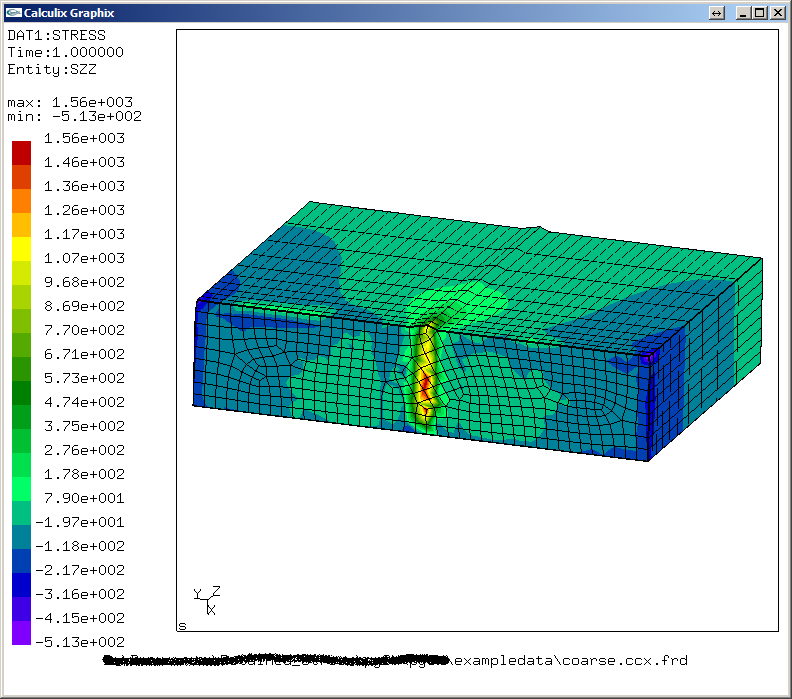

# preprocess

## Background
Tool for both pre-processing and running the linear elastic Finite Element Analysis step of the contour method. Intended to work with Abaqus, Gmsh and Calculix to provide completely open source analysis and commercial benchmarking.

For more information on Gmsh and Calculix:

Gmsh: http://gmsh.info/

Calculix: http://www.dhondt.de/

## Initializing

**Input and output descriptors**

The input consists of a *.mat file which contains the following data structures:
Input | Description
---  |---
`ref` structure	| At minimum contains an `x_out` field, see [point_cloud](point_cloudREADME.md): Nx3 matrix of the points that comprise the outline.
`spline_x` structure | Contains the following fields:<ul><li>`knots`: Nx2 cell arrays of knots in the x & y directions, respectively.</li><li>`dim`: dimension of the spline (required for MATLAB interoperability)</li><li>`form`: form of the spline - defaults to 'B-' (required for MATLAB interoperability)</li><li>`number`: Nx2 the number of knots in x and y, respectively (required for MATLAB interoperability)</li><li>`tck`: FITPACK generated spline information, a list that contains the knots, coefficients and order.</li><li>`coefs`: matrix of coefficients with dimensions of dimxNxM, according to the dimension, x and y directions (required for MATLAB interoperability)</li></ul> See [fit_surface](fit_surfaceREADME.md).

Depending on which analysis route is selected, there is a variety of files that will be generated. Pre-processing can be carried out either following solely an open source route, either employing Abaqus or Gmsh to generate a mesh and boundary conditions. The final linear elastic analysis can either be conducted via Calculix or Abaqus, and analysis files are generated for each of those. The following table outlines both optional and mandatory files that are generated.
Output | Description
---  |---
*.geo | Gmsh script file. If generated during outline processing, this will be a 2D outline of the component corresponding to an 'optimized' `x_out`. If written as part of the 3D mesh generation process, then this will be the script corresponding to generating the full mesh.
*.dxf | Drawing eXchange Format file. Corresponds to an 'optimized' `x_out` which generates a uniform mesh. *Required for performing Abaqus-based preprocessing*.
*.py | Abaqus Python script file containing Abaqus CAE commands required to build a mesh based off of the *.dxf file.
*.inp | Intermediate input file containing *only the mesh* generated by the Abaqus Python *.py file.
*.vtk| Legacy text-based Visualization ToolKit file containing the mesh generated either by Abaqus CAE (converted output) or Gmsh (native output)
*.ccx.inp | Calculix input deck file which contains the mesh and boundary conditions.
*.abq.inp | Abaqus input deck which contains the mesh and boundary conditions.

The contents of these files, and paths to them are stored in the loaded *.mat results file, so that the *.mat contains a record of all input data associated with the analysis. Upon reloading the *.mat file, if the respective file is not found, it will be written from the *.mat file according to the path that is available so that it may be executed.

Any additional files generated will be generated by the respective FEA tool employed, either Calculix or Abaqus. Post processing is carried out on output from these solvers. Specifically, *.odb file with Abaqus Viewer and *.frd files from Calculix's CGX post processor. Alternatively, stresses at integration points are written directly to *.dat files for third-party contour plotting, irrespective of which solver is employed. *Output files are not currently passed to the *.mat file.*

The tool can be called from interactive Python, for example:
~~~
>>>from pyCM import preprocess as pp
>>>pp.FEAtool()
~~~
which if it is run the first time, a GUI will ask for paths to various executables for FEA. This dialog can be accessed again at any time from the preprocess tool by pressing **e**. Settings are saved to the pyCM installation location. See [Fig. 1](#fig1).

  
* Figure 1: FEA executable dialog*

Alternatively, the input file and output directories can be specified directory. The output directory in this case is the location where the FEA will be conducted:
~~~
>>>from pyCM import preprocess as pp
>>>pp.FEAtool('PathToMatFile.mat','PathToFEADirectory')
~~~

##  Interaction functionality
On launching, the interactor will load the contents of the `x_out` matrix obtained from metrology. Depending on the quantity of points, this outline may have too dense (or too few) a number of points to generate an appropriate mesh. Therefore, a facility for 're-spacing' or a shape-preserving re-population of the outline is provided in the top left pane. Fields in the **Outline modification** pane are pre-populated based on information in the `spline_x` structure, which in turn is based on current best practice. The outline can be seeded on the basis of nodal spacing, or total number of nodes. Spacing/counts are amended such that an even number is obtained to avoid issues with meshing. Changes are imposed with the **Generate** button. This modified outline *can* be written as a *.geo file if Gmsh is to be used for subsequent meshing, but *must* be written as a *.dxf file if Abaqus CAE is to be employed. See [Fig. 2](#fig2).

  
* Figure 2: Outline modification*

Once the outline has been generated, either a Gmsh script or Abaqus Python CAE script can be generated which extrudes the outline and partitions this extrusion with a geometric distribution. The algorithm for doing so will ensure that the first partition depth is essentially equal to the node spacing specified in the outline generation step. Either quadrilateral 8 noded brick elements or 4 noded tetrahedral elements are supported. This is accomplished by employing the **Generate mesh** pane, and pressing the **Execute** button. This will submit the script to either Gmsh or Abaqus depending on the radio button, and then update the interaction window to show the resulting mesh. See [Fig. 3](#fig3).

  
* Figure 3: Mesh generated by Abaqus CAE*

Next, imposing boundary conditions (BCs) and elastic properties is accomplished with the **Impose BCs & material** pane. Displacement boundary conditions on the cut face are imposed by pressing the **Impose spline fit button**. Rigid body BCs are selected by first clicking **Choose**, then clicking on the desired location for x & y and pressing **p**, which is followed by selecting another corner for either x or y. See [Fig. 4](#fig4).

  
* Figure 4: Imposed boundary conditions*

In the **Compose FEA** pane, either a Calculix or Abaqus input deck can be written *regardless of which route was employed to mesh*, and will be automatically processed if the **Run** radio button is selected. Both the Python command line and the interactor will update according to solution status. The results can then be assessed with post-processors available to each respective FEA package, for example CGX as shown in [Fig. 5](#fig5).

  
* Figure 5: Calculix CGX post-processor*

**Keyboard and mouse mapping**
Key | Description
---  |---
Left mouse button 	|Rotate about the center of view
Middle mouse button 	|Pan
Right mouse button 	|Zoom/refresh window extents
1 	|View 1, default, looks down z axis onto xy plane
2 	|View 2, default, looks down x axis onto zy plane
3 	|View 3, default, looks down y axis onto zx plane
z | Increase z-aspect ratio of displacement BC
x | Decrease z-aspect ratio of displacement BC
c | Return to default z-aspect
f | Flip colors from white on dark to dark on white
i | Save output to .png in current working directory
r | Remove/reinstate outline
LMB+p | The p button with the *Left mouse button* allow for selecting rigid body boundary conditions. Click first and then press p to select.
e | Allows the user to change their FEA executable location/path
l | load/reload *.mat file to conduct/review/revise this analysis step

Processing is intended to be procedural, working top to bottom with the pane on the right hand side of the GUI. Status and updates are provided by the italicised line on the bottom of the GUI pane, as well as periodic messages to the terminal/command line.

## Known issues
If the FEA submission fails, check the directory that it was run from and try running it manually. On Windows, it's been observed that Calculix's Cygwin coupling can conflict with other Cygwin applications.