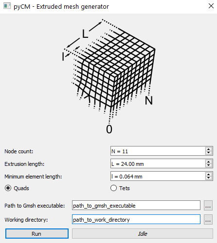

# preprocess

## Background
Tool for both pre-processing and running the linear elastic Finite Element Analysis step of the contour method. Intended to work with Abaqus, Gmsh and Calculix to provide completely open source analysis and commercial benchmarking.

For more information on Gmsh and Calculix:

Gmsh: http://gmsh.info/

Calculix: http://www.dhondt.de/

This function allows for the generation of meshes directly from outlines, or can import meshes created elsewhere. The means for manipulating the mesh and applying boundary conditions for both CalculiX and Abaqus is provided, as well as a utility for running FEA from within the application.

## Initializing

This function can be called independently by importing the preprocess module from pyCM and then calling launch:

~~~
>>>from pyCM import preprocess as pre
>>>pre.launch()
~~~

Then, upon launching, the pyCM data file can be loaded via a GUI by pressing the `l` key if launched independently, or by specifying the file directly i.e. `pre.launch('full_path_to_file.pyCM')`. If using the pyCM [main](mainREADME.md) function, `Shift+l` will load any data from the active file. This results in a populated widget as shown in [Fig. 1](#fig1).

  
* Figure 1: Preprocessing widget displaying a loaded pyCM file with data from the fit_surface step.*

This pyCM file must contain the following at minimum:

Input | Description
---  |---
`ref` structure	| At minimum contains an `outline` field, see [registration](registrationREADME.md): Nx3 matrix of the points that comprise the outline on a per entry basis.
`fit` structure | See [fit_surface](fit_surfaceREADME.md).

The user then has the decision as to use the built-in mesh generation tool via Gmsh, or import a mesh and manipulate it to align with the outline(s).

## Outline modification
Targetting a specific entry for an outline is acheieved with the drop-down menu. Optionally, entries can be captioned by selecting the `Caption entries` checkbox, similar to that employed in previous steps/functions.

Corners can also be identified with annotations - note that these 'corners' are points on the outline which have the smallest straight-line (Euclidean) distance from the corners of the bounding box of each respective entry. This is achieved by activating the `Caption corners` checkbox (on by default).

Next, the outlines can be re-spaced. This algorithm can either set the spacing between points or target a total number of them, depending on whether `Spacing` or `Quantity` radio buttons are selected when `Update` is pressed. The algorithm attempts to preserve the locations of corners (i.e. adding or removing points between each of the corners defined above. The result can then be exported as a *.dxf (Drawing eXchange Format) file, which in turn can be used by a second party meshing tool outside of pyCM.

## Mesh
The `Mesh` panel contains tools for generating and/or manipulating a mesh. There are two routes to follow:

* If a single entry is available (i.e. there is only Entry 0), then the `Extrude` function can be used.
* If a mesh is to be imported, then the `Import` function can be employed.

### `Extrude` function
The extrude function *operates solely on entry 0*, which means that any outline modification should take place prior to starting this step. Points on the outline will serve as seeds in the xy sense for an extruded mesh along the z direction with a geometric distribution of nodes along this direction. This is achieved with a dialog that launches when the `Extrude` button is pressed ([Fig. 2](#fig2)).

  
* Figure 2: Preprocessing extrude dialog.*

Options for generating this mesh include the number of nodes along the z direction (Node count, N), the total length to extrude along (Extrusion length, L) and the minimum element length (Minimum element length, l). Depending on which radio buttons are selected, either linear quadrilateral elements are employed (`Quads`), or quadratic (second order) tetrahedra (`Tets`). The path to the Gmsh executable can be specified, as well as the working directory: note that this working directory is the same as that specified for the FEA step described below. These entries (`Path to Gmsh executable` and `Working directory` are persistent, meaning that unless pyCM is uninstalled, will load each time pyCM starts.

Pressing the `Run` button will launch a GUI asking a the user what to call the *.geo file in the working directory, and then will run Gmsh on this file to generate a *.vtk file with the same prefix. Once complete, the resulting mesh will be read back into pyCM, filtered such that non volumetric elements are removed and then becomes free to be manipulated (if desired).

### `Import` function
Pressing the `Import` button will launch a GUI for the user to specify either a *.vtk file (preferable) or an *.inp file. In both cases, the mesh will need to be comprised of either 8 noded linear quadrilateral elements, or 10 noded second order tetrahedra. Any other element types will be filtered out. *This is the route to employ if there is more than one entry to be considered.*

For importing meshes in an *.inp format, node numbering should be continuous, as should element numbering. There should also be at least one node set and one element set due to the interpreter recognising the associated keywords in the file. Note that these sets will not be preserved in the final *.inp file generated by pyCM. 
The interpreter will generate a *.vtk file with the same prefix as the *.inp file specified in the same directory. The interpreter employed for this latter case can be tested on *.inp files prior to being employed within the pyCM analysis chain via:
~~~
from pyCM.pyCMcommon import convert_inp_to_vtk
convert_inp_to_vtk('full_path_to_inp_input.inp','full_path_to_vtk_output.vtk')
~~~

**pYCM employs millimetres as the unit of length and meshes imported should employ this convention as well.*

### Other functionality
Once a mesh has either been extruded or successfully imported, it can be manipulated with the remainder of the tools in the the `Mesh` panel. This includes mirroring on the xy plane (`Mirror`), as well as the ability to specify a 2D transformation (entering values for x and y and a rotation about z and pressing `Apply`).

For a more direct, three dimensional, rigid body transformation of the mesh to the outline, nodes which qualitatively align best with the 'corners' identified on the outlines of each entry. This is acheived by pressing the **n** key to activate node selection, and selecting the node which best corresponds to a corner identified with the `Caption corners` option turned on. With node selection active and a node picked, pressing either **a** to accept or **d** to discount ([Fig. 3](#fig3)).

  
* Figure 3: Node selection process for alignment to outlines. Nodes 0 through 2 have been accepted as matching the respective corners on outlines, while node 4 has been selected but not accepted by pressing **a**. Pressing **d** at this point would revert the selection for 2.*

Once all nodes have been selected (in the present example, 8, corresponding to 8 corners on two entries), then a 3D transformation can be calculated either with the `Corner SVD` or `VTK ICP`. Note these are the same algorithms employed in [align_average](align_averageREADME.md) with the important exeption for `Corner SVD`: in the present case it is a 3D transformation, whilst in the latter alignment case is implmented as 2D.

It is recommended that once the transformation is implemented, that `Caption corners` in the `Display` panel is de-selected to allow for easier selection of rigid body boundary condition nodes.

## Impose boundary conditions and material
The same approach for selecting nodes for alignment purposes has been employed for specifying rigid body boundary conditions. Pressing **b** starts the selection process, with subsequent presses of **a** or **d** to accept or discount choices of nodes. The first node accepted will have both x and y degrees of freedom constrained, while the second choice will have the y direction degree of freedom constrained.

Next, pressing `Impose surface BCs` will show a scalable preview of the displacement boundary conditions applied to the surface. Note that the orientation of the mesh along the z axis is inconsequential to the direction of the boundary conditions. For example if the mesh were to be imported and aligned such that all nodes reside on the positive z axis, then the boundary condition applied will be the fit surface. Whereas if all nodes reside on the negative z axis, then the fit surface will be inverted. [Fig. 4](#fig4) shows all boundary conditions applied to a multi-entry dataset.

  
* Figure 4: A complete set of conditions imposed for an FEA to calculate stresses. Rigid boundary conditions are shown wiht red arrows, while the displacement boundary condition corresponding to the contour is shown in yellow.*

Finally, the modulus of elasticity to employ can be entered in MPa, and Poisson's ratio can also be instituted.

## Write current
The `Write current` panel provides the ability to save relevant information pertaining to the FEA for the purposes of running at a later date, or to both save relevant data to the pyCM file and run the FEA analysis by selecting `Run FEA on save` (on by default) and pressing `Save`.

This will present the FEA widget which allows the option of running the FEA either with Abaqus or with CalculiX in a working directory specified ([Fig. 5](#fig5)). A further option is presented such that the results are extracted from relevant files upon conclusion of the analysis, or not - with the `Extract results after run` option selected (on by default). Deselect this if the intention is to employ another postprocessor other than the one in pyCM.

  
* Figure 5: FEA widget showing entries/arguments for running with either CalculiX or Abaqus, as well as updating the FEA working directory.*

Both the CalculiX executable and working directory can be browsed to by selecting the buttons with 3 dots. Due to vagaries of how Abaqus is installed on different systems, this may be `abaqus` or `abqxxxxhfy` with `xxxx` the release year of Abaqus installed and `y` the the hotfix number. The entry here is the command that is employed at the command line to start CAE, Viewer or any other Abaqus command/environment. Regarding obtaining a compiled version of CalculiX for Windows, the `ccxXXX.exe` (`XXX` is the version number) necessary can be obtained from the *CalculiXforWin* project. CalculiX version 2.11 have been found to work.

Selecting `Run` with the `Abaqus` radio button selected will ask the user to name their input file via a GUI in the working directory specified. The exact command that will execute is:
~~~
abaqus job=myjob int ask_delete=OFF
~~~
where `abaqus` is the command entered in the `Abaqus executeable` line, `job` is the file prefix of the input file selected by the user, `int` is to run it interactively and `ask_delete` will overwrite any file instead of querying. The same concept is true for the CalculiX option. Output/updates of job progression will be written to the command line, and the dialog will inform the user when the job has finished.

The data that is written to the pyCM file for this entire process is as follows:

Output | Description
---  |---
*.inp | Either Abaqus or Calculix input deck file which contains the mesh, material properties and boundary conditions - also saved to the specified working directory. Only written if `Run FEA on save` is checked when `Save` is pressed.
Boundary conditions | A `bc_prop` structure written to the subject pyCM file, with the modulus and poisson's ratio specified as attributes. On a per entry basis, this structure contains `bc_disp_val` which are the displacements in the z axis per node, an `outline` and `surface_nodes` - the index of nodes that are on the surface to have boundary conditions applied. At the top level of this group is `rigid_body_nodes`, whih is an index of which nods have rigid body boundary conditions applied, and a `transform` object - the homogeneous 4x4 transformation matrix that has been applied to the mesh from either being generated or imported.
Mesh information | A `mesh` strucutre with fields/groups correspoinding to an unstructured grid with point data. This includes `points`: node locations, `cells`: element connectivity, `cell_types`: an array of VTK cell (elements) types, `cell_locations`: cell/element numbering. A final group `point_data` will be written if postprocessing data is included: entries for `S11`, `S22` and `S33` - stresses relieved by the cut in the x and y directions, as well as the full stress component acting in the z direction, respectively.

## Keyboard and mouse mapping

Key | Description
---  |---
Left mouse button 	|Rotate about the center of view
Middle mouse button 	|Pan
Right mouse button 	|Zoom/refresh window extents
1 	|View 1, default, looks down z axis onto xy plane
2 	|View 2, default, looks down x axis onto zy plane
3 	|View 3, default, looks down y axis onto zx plane
z | Increase z-aspect ratio of displacement BC
x | Decrease z-aspect ratio of displacement BC
c | Return to default z-aspect
n | Enters into node selection mode for aligning 'corners' of outlines to the mesh. Once active, the *a* button accepts the selection, *d* deselects. Pressing *n* again exits this selection mode.
b | Enters into node selection mode for picking nodes to apply rigid body boundary conditions. Once active, the *a* button accepts the selection, *d* deselects. Pressing *n* again exits this selection mode.
l | load/reload *.pyCM file to conduct/review/revise this analysis step

## Known issues
If the FEA submission fails, check the directory that it was run from and try running it manually. On Windows, it's been observed that Calculix's Cygwin coupling can conflict with other Cygwin applications. Very large meshes will cause the 32 bit version of CalculiX to fail due to a lack of memory. Extraction of stresses from Abaqus analyses can take significantly longer than for CalculiX.