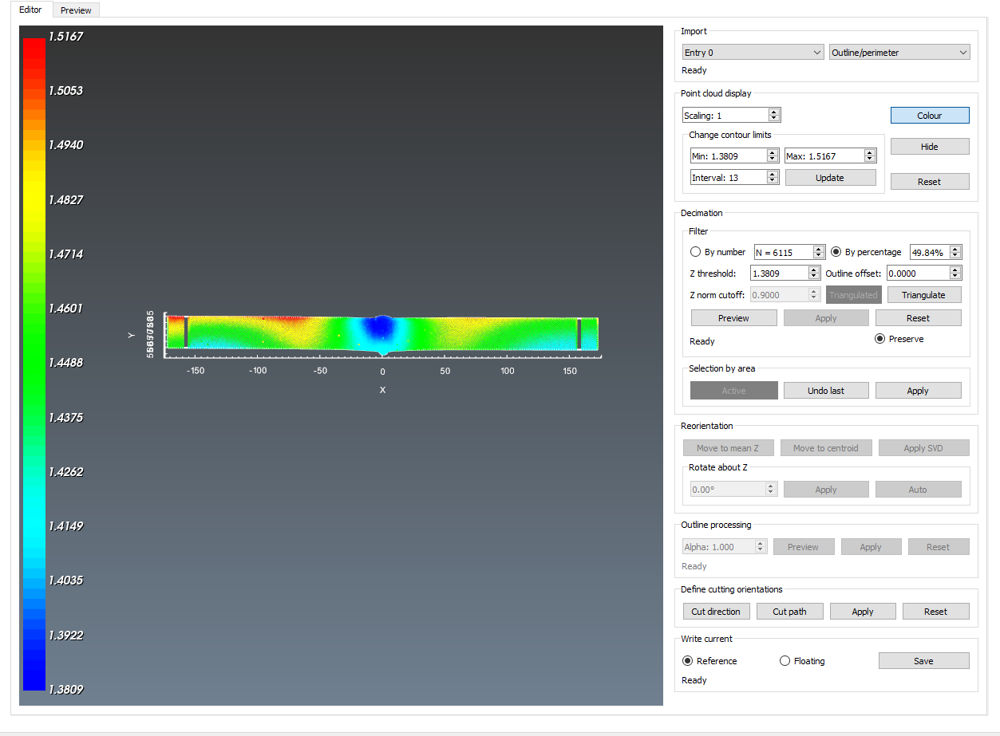
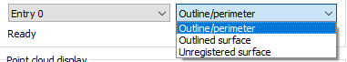
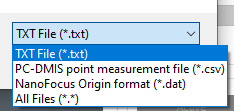
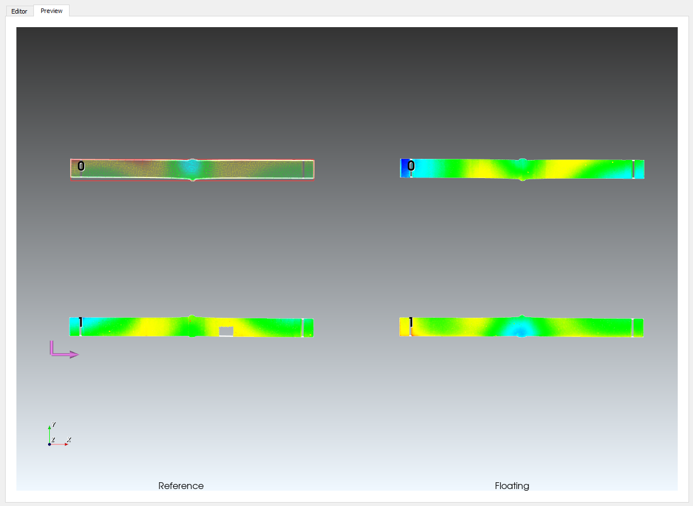

# registration

## Background
It has been found that it is occasionally necessary to mask point clouds in advance of alignment and averaging. Often spatial filtering is not completely effective in removing spurious points, or there are portions of a surface measurement result that the analyst does not want to consider. In the latter case, this includes cutting wire entry/exit artefacts, localized plasticity effects near restraint features and so on.

A tool has been developed to perform this type of masking, called point_cloud. It is intended to operate on two types of data:

1. Point clouds generated by laser profilometry after primary processing such that they can be segregated into a discrete outline and surface point cloud as text/whitespace delimited files, this includes data generated by Coordinate Measurement Machines (CMMs).
2. Unregistered point clouds - that is, surfaces that do not have any boundaries or outlines defined.

This method allows a user to load and visualize a point cloud, select points to be occluded or deleted from further analyses and then write an output file containing the point locations and whether they were masked. This function can delete points, and steps which this occur are identified subsequently.

## Initializing
Registration starts by following two routes: either importing an outline/perimeter *and* and its associated outlined surface are loaded in, one at a time, or an unregistered set of points are loaded in, such that an outline can be extracted. This function can also be called from the pyCM main routine, see [main](mainREADME.md).

The function is called from a Python script or in interactive mode, starting by importing point_cloud module from the pyCM package and then calling the `launch` method for example: 
~~~
>>> from pyCM import registration as reg
>>> reg.launch()
~~~

This will launch a blank GUI to specify a data associated with subsequent analysis, rooted in the current working directory. [Fig. 1](#fig1) Shows an overview of what the interactor looks like, with the main functions for editing an entry located in the `Editor` tab, which in turn populates the `Preview` tab with processed entries appearing upon saving data from the `Editor` tab.

  
* Figure 1: Registration widget with editor tab active, appearing as when first launched without an existing analysis data file specified.*

Immediately upon selecting which data type to load ([Fig. 2](#fig1)) from the drop-down menu in the 'Import' panel, a file selection GUI will launch, and the data will load. After which, the various input boxes will activate e.g. `Point cloud display`, `Decimation`, `Reorientation`, `Outline processing`, `Define cutting orientations` and finally `Write current`. Only after actuating the `Save` button in this latter panel will data be able to be seen in the `Preview` tab.

## Editor - Import
The `Import` panel allows for brining data in describing each of the cut surfaces. Within this panel, there are two drop-down menus. The first is the 'entry' box, which allows the user to specify which entry is active. Most cuts will only have 1 entry, which means that the default entry remains 0 for both the reference and floating data. See 'Saving data' below. The second drop down specifies which input data to load. This is as follows:

Input | Description
---  |---
Outline/perimeter file |	Text files and PC-DMIS comma seperated variable files permitted. If not specified directly, location is acquired via GUI.
Outlined surface |	Text,  PC-DMIS comma separated variable and white space delimited files are supported.

**OR**

Input | Description
---  |---
Raw point cloud file |	NanoFocus-type `*.dat` files in `Origin` format are supported. If not specified directly, location is acquired via GUI.

The most common/default way of importing data is via text files with whitespace (standard) or three comma separated variables - note both have a `.TXT` or `.txt` extension. Basically, these are `*.xyz` files without normals. For example:

'0.095155   -43.346  1.5185	
0.097489   -53.637   1.5185	
...   ...   ...	'

or

'0.095155, -43.346, 1.5185	
0.097489, -53.637, 1.5185	
...   ...   ...	'

The other format is a `*.csv` file that can be imported into *non*-DMIS packages such as (confusingly) PC-DMIS, MCOSMOS, Calypso etc. Note that a complete programme will need to be created such as probe selection, intermediate points and so on. The file will contain an appropriate header along with labels according to:

|TYPE	|NAME	|X			|Y		|Z		|I	|J	|K|
|--- |---|---|---|---|---|---|---|
|POINT	|PNT1	|0.092801	|-48.491|1.5185	|0	|0	|1|
|POINT	|PNT2	|0.095155	|-43.346|1.5185	|0	|0	|1|
|POINT	|PNT3	|0.097489	|-53.637|1.5185	|0	|0	|1|
|POINT	|PNTn	|...		|...	|...	|0	|0	|1|

Finally, a `*.dat` file or a `*.txt` file that represents only surface data and *does not* contain an outline can be loaded. While the `*.txt` should take the format described above, the `*.dat` format matches a NanoFocus `Origin` type output and is as follows:

|X/[µm]        	              |Y / [µm]      	              |z / [µm] |
|---|---|---|
|0.0000        	              |0.0000        	              |-542.4800|
|30.0000       	              |0.0000        	              |-542.4800|
|60.0000       	              |0.0000        	              |-542.4800|
|90.0000       	              |0.0000        	              |-542.4800|
|...		|...	|...	|

**Note that the units are assumed to be µm for the `*.dat` file and are converted to mm by pyCM. The `*.txt` and `*.csv` formats are assumed to be in mm.**

  
* Figure 2a: Selection options for raw data.*

  
* Figure 2b: File type selection in GUI launched by the selection options for raw data.*

Specifying file types is accomplished through the GUI ([Fig. 2](#fig2a)). Beyond the outline/perimenter file, other sources can contain as many entries as required. For example, if an axial contour cut on a pipe was conducted, then the data file (either unregistered or outlined) could contain both 'entries' in the same file. Then the user should then decimate parts of that file which does not constitute that part of the entry, and then outline/register each and save them as individual entries.

## Editor - Point cloud display
The `Point cloud display` panel contains tools for manipulating the point cloud observed. As contour data has dimensions that are sometimes orders of magnitude larger in x and y than variation in z, a means for scaling the z-aspect of the data has been provided, under `Scaling`. Either changing this value directly or by pressing `z` increases the aspect ratio by 2x with each keypress, pressing `x` decreases by half, and `c` returns to the default aspect ratio.

Colouration by z-value is the standard display of points active within the point cloud. Toggling `Colour` brings the point cloud back to monochromatic. The `Change contour limits` panel allows for changing the colour scale. The `Reset` button within this panel resets colouration and re-draws the point cloud.

## Editor - Decimation
Decimation takes place either via the `Filter` route, or by manually using `Selection by area`. The `Filter` route has 4 operations for a total of N raw points:

* Setting a target number of points, either by count, or by percentage of the total. Changing/selecting the `By number` or `By percentage` actuates this.
* If registered (that is an outline is available), select points by polygon offsetting. For example, to remove points that are 0.1 mm outside of the outline, enter this value into `Outline offset`. Alternatively, to remove points 0.1 mm within the outline, enter -0.1.
* Remove all points below a particular z value. This is done by entering this value in `Z threshold`.
* Remove points if their triangulation results in their being cointained in a tesselation that is below a particular normal. This is done by entering a value under `Z norm cutoff`, and pressing the `Triangulate` button.

These filters are applied an previewed simultaneously by pressing the `Preview` button. To effect them, press `Apply`. To reverse/undo *all* filters, including selection(s) by area, this is acheived by pressing the `Reset` button. The `Preserve` button should remain selected, otherwise, `Apply` will be permanent, and any points that have been removed will **no longer be tracked as part of the analysis**.

In order to manually select points to deactivate, there is an interaction sequence which is triggered from the VTK interactor window. Pressing `r` will disable rotation such that using the left mouse button will enable the user to draw a rectangular window around points to be removed. This rectangle can be drawn and redrawn any number of times; panning and zooming are accessible by deactivating picking mode by pressing `r` once more. The *Active* indicator will activate when the picker is active. This can be repeated any number of times. If a mistake is made, then the last pick can be undone with the `Undo last` button to deselect all highlighted points the last time the picker was active. If a mistake is made, or if other entries are to be defined, then the entire dataset can be reactivated with the `Reset` button in the `Filter` pane - if `Preserve` was selected prior to pressing `Apply`.

## Editor - Reorientation

Four options for reorienting data are presented if 'Entry 0' is active:

* Data sets where there is an appreciable difference between the mean z value of the outline versus the point cloud can be corrected by selecting `Move to mean Z`.
* Data can have the origin changed from the incoming metrology data to the geometric centroid by `Move to centroid`.
* Skewed data can be corrected for by applying a Single Value Decomposition (SVD) such that the normal of the point cloud is aligned with the z axis. This operates on 25,000 points obtained by the decimation filter applied above. This is effected by `Apply SVD`.
* Data can be rotated about the z axis either manually by specifying an angle, or attempt to align the longest dimension of the bounding box along the x axis. `Apply` applies a manual rotation, `Auto` attempts to align the longest dimension.

Any of the manipulations performed here are stored locally with a transformation matrix. This matrix is unique to either the reference or floating data; the transformation matrix is reset upon loading either an unregistered or registered point cloud (from raw data), or applied upon loading data from the `Preview` tab.

## Editor - Outline processing

Some optical scanning does not encompass outline processing. Edge finding algorithms borrowed from image processing techniques are only applicable to regularly ordered images (i.e. rectangular arrays of data that can be represented by pixels). The outline processing capabilities incorporated into pyCM rely on filtering points directly, or based on a triangulation and then concave hull processing using an alpha shape algorithm. Depending on the number of points being assessed, this can take some time to complete. Therefore, it is recommended that all decimation be carried out first prior to attempting to process an outline. This is carried out by changing the `Alpha` parameter and pressing preview. `Apply` will apply the preview and register the point cloud. `Reset` will remove the outline and permit re-running the outline filter.

Any decimation prior to an outline being applied will necessitate a subsequent triangulation to re-calculate a valid triangulation. However, if no points are removed, then different values of `Alpha` can be tried without having to re-triangulate each time. As point cloud densities and their respective response to this algorithm vary, it is recommended that the user experiments to find a value of `Alpha` that works for them.

## Editor - Define cutting orientations

This particular step is very much optional, but allows for storing both a cutting direction with `Cut direction` and `Cut path`. Upon selection of each direction `Apply` will generate a glyphed actor. `Reset` undoes any selections. 

The cutting direction corresponds to how the means of cutting traversed the part, whereas the cutting path defines the direction that the cutting media took through the part. For example, for a part that was cut with an EDM, the cutting direction is the direction the wire took through the part, where as the cutting path is the direction the wire travelled between each electrode/jet (or from spool to waste).

These directions are entered in for 'Entry 0', and when combined create a unique orientation of each cut surface (reference and floating). This information in turn can be used to categorically identify which mirroring orientation to apply, and further, to corroborate any artefacts in final results (e.g. identifying cutting induced plasticity, etc.).

## Editor - Write current
The following describes what will be saved upon pressing `Save` in the `Write current` panel in the `Editor` pane. Based on what entry is selected in the `Import` pane, an outline and a point cloud must be present/registered prior to attempting to save. Depending on which side of the cut is being examined, the appropriate radio button must also be selected on a per-side, per-entry basis. The following describes the specific items that are written to the HDF5-formmatted `*.pyCM` file.

Output | Description
---  |---
Output file	| A .pyCM file will be written to the specified output directory. At minimum, it will contain two data structures needed for subsequent processing, `ref` and `float`, having optional attributes relating to cutting orientation, and the following groups on a per-entry basis:<ul><li>`points`: Nx3 array of the coordinate values.</li><li>`active`: An integer array of points indexing which points are actively being considered.</li><li>`outline`: Nx3 matrix of the points that comprise the outline</li></ul> Finally, for each the `float` and `ref` data groups, a `transform` entry is also included, which captures the transformation matrix applied to each group.

## Preview
The `Preview` tab ([Fig. 1](#fig3)) is meant to show the result of data saved via the `Editor` tab. That is, show what each entry looks like for both the reference and floating datasets. Note that the reference surface requires being saved first. If an error has been made regarding which side of the cut should be taken to be the reference, then it can be saved in the floating slot. Once the *actual* reference surface is processed, it can be saved to the reference slot, overwriting the existant. From this tab, one may select an entry for further editing - pressing `p` will allow an entry to be selected, and upon switching back to the `Editor`, that dataset should be available for editing all aspects on the basis of entry.

After edits are made, then the respective entry can be saved to the datafile.

  
* Figure 3: Registration widget with preview tab active. This tab appears when loading an existing pyCM data file. Note that entry 0 of the Reference is currently highlighted for editing - changing tabs back to the editor tab will load this dataset for decimation and cutting orientations. In this example, the cutting orientation has only been entered on the reference dataset, and appears as the purple glyph.*

Loading registration data from a pyCM file outside of using the pyCM [main](mainREADME.md) function can be accomplished by modifying the command above by specifying an argument for `launch`:
~~~
>>> from pyCM import registration as reg
>>> reg.launch('full_path_to_file.pyCM')
~~~

A complete list of interaction keys is provided below. 

## Keyboard and mouse mapping

**Editor**
Key | Description
---  |---
Left mouse button (LMB)	|Rotate about the center of view
Middle mouse button 	|Pan
Right mouse button 	|Zoom/refresh window extents
1 	|View 1, default, looks down z axis onto xy plane
2 	|View 2, default, looks down x axis onto zy plane
3 	|View 3, default, looks down y axis onto zx plane
r 	|Enter/exit manual point picking mode, LMB is used to generate a selection window. Pressing key again exits selection mode.
z 	|Increase z-aspect ratio by a factor of 2
x 	|Decrease z-aspect ratio by a factor of 0.5
c 	|Return to default z-aspect ratio; x,y:z=1:1
a 	|Remove/reinstate compass/axes

**Preview**
Key | Description
---  |---
Left mouse button (LMB)	|Rotate about the center of view
Middle mouse button 	|Pan
Right mouse button 	|Zoom/refresh window extents
1 	|View 1, default, looks down z axis onto xy plane
p 	|Enter/exit entry picking mode. Pressing key again exits picking mode.

## Known issues

Loading of extremely large datasets (2M points or more) will diminish performance. Point clouds are better off sampled and reduced before using these tools.